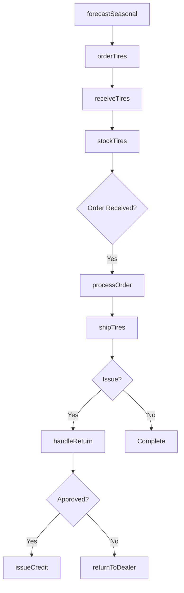
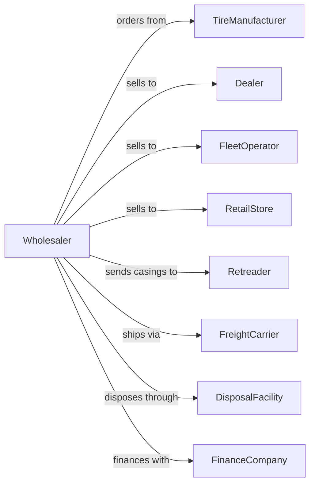

# Tire and Tube Merchant Wholesalers

> Business-as-Code definition for tire and tube wholesale distribution operations. Models inventory management, dealer programs, and logistics for rubber products.

## Overview

Tire and tube wholesalers distribute passenger, commercial, agricultural, and specialty tires along with inner tubes and tire accessories to dealers, service centers, and retailers. This definition exposes actions for tire sourcing, warehouse operations, dealer program management, and returns processing with events for seasonal demand and inventory optimization.

## Actors

| Actor | Description |
|-------|-------------|
| TireManufacturer | Produces tires and sets dealer programs |
| Dealer | Tire dealership or service center |
| FleetOperator | Commercial fleet requiring tire supply |
| RetailStore | Automotive retail chain selling tires |
| Retreader | Processes used tires for retreading |
| FreightCarrier | Transports tire shipments |
| DisposalFacility | Handles end-of-life tire disposal |
| FinanceCompany | Provides inventory financing |

## Roles

| Role | Description |
|------|-------------|
| BrandManager | Manages manufacturer relationships and programs |
| WarehouseManager | Oversees tire storage and handling |
| SalesRepresentative | Serves dealer accounts and territories |
| LogisticsCoordinator | Plans deliveries and routes |
| CreditManager | Manages dealer credit and collections |

## Entities

| Entity | Description |
|--------|-------------|
| Tire | Individual tire with size, brand, and specs |
| Inventory | Stock levels by size, brand, and location |
| PurchaseOrder | Order placed with manufacturer |
| SalesOrder | Dealer order for tires |
| DealerProgram | Manufacturer rebate and incentive program |
| Shipment | Outbound tire delivery |
| Return | Warranty or adjustment claim |
| Warehouse | Distribution center for tire storage |
| SeasonalForecast | Demand projection by season |
| DealerAccount | Customer profile with program enrollment |
| CasingCredit | Value for returned tire casings |

## Actions

| Action | Description |
|--------|-------------|
| orderTires | Place purchase order with manufacturer |
| receiveTires | Check in incoming tire shipment |
| stockTires | Place tires in warehouse locations |
| processOrder | Fulfill dealer tire order |
| shipTires | Dispatch delivery to customer |
| handleReturn | Process warranty or adjustment claim |
| enrollProgram | Add dealer to manufacturer program |
| submitRebate | File manufacturer rebate claim |
| collectCasings | Gather used tires for retreading credit |
| forecastSeasonal | Project demand for winter/summer seasons |
| runPromotion | Execute special pricing or programs |
| transferInventory | Move stock between warehouses |
| disposeTires | Arrange end-of-life tire handling |
| auditInventory | Verify physical tire counts |

## Events

| Event | Description |
|-------|-------------|
| orderReceived | Dealer placed tire order |
| tiresReceived | Manufacturer shipment arrived |
| tiresStocked | Inventory added to warehouse |
| orderShipped | Tires dispatched to dealer |
| orderDelivered | Dealer received tire shipment |
| returnFiled | Warranty claim submitted |
| returnApproved | Manufacturer approved adjustment |
| rebateEarned | Dealer qualified for rebate |
| seasonChanging | Seasonal tire demand shifting |
| stockLow | Inventory below target level |
| programUpdated | Manufacturer changed dealer program |
| casingCollected | Used tire casing received |

## Searches

| Search | Description |
|--------|-------------|
| findTires | Search by size, brand, type, speed rating |
| getInventory | Check stock by size and location |
| getDealerOrders | Retrieve orders by dealer or status |
| getProgramStatus | View dealer program enrollment and earnings |
| getRebates | Track pending and paid rebates |
| getCasingCredits | List casing return credits |
| getSeasonalStock | View seasonal inventory positions |

## Workflow



## Actor Relationships



## Usage

### Calling Actions

```typescript
import { wholesaleTireTube } from '@headlessly/wholesale-tire-tube'

const wholesaler = wholesaleTireTube()

// Search tire inventory
const tires = await wholesaler.findTires({
  size: '225/65R17',
  type: 'all-season',
  brands: ['michelin', 'goodyear'],
  minQuantity: 20
})

// Process dealer order
const order = await wholesaler.processOrder({
  dealerId: 'tire-shop-789',
  items: [
    { sku: 'MICH-DEF-225-65-17', quantity: 8 },
    { sku: 'GY-ASS-225-65-17', quantity: 12 }
  ],
  deliveryDate: '2024-03-01'
})

// Submit manufacturer rebate
await wholesaler.submitRebate({
  manufacturerId: 'michelin',
  programId: 'q1-volume-bonus',
  dealerId: 'tire-shop-789',
  qualifyingUnits: 150
})
```

### Event-Driven Automation

```typescript
// Prepare for seasonal shift
wholesaler.seasonChanging(async ({ newSeason, region }) => {
  const forecast = await wholesaler.forecastSeasonal({
    season: newSeason,
    region
  })

  await wholesaler.orderTires({
    items: forecast.recommendedStock,
    priority: 'pre-season'
  })
})

// Auto-process casing credits
wholesaler.casingCollected(async ({ dealerId, casings }) => {
  const credit = calculateCasingValue(casings)

  await wholesaler.issueCasingCredit({
    dealerId,
    amount: credit,
    casings: casings.map(c => c.id)
  })
})
```
