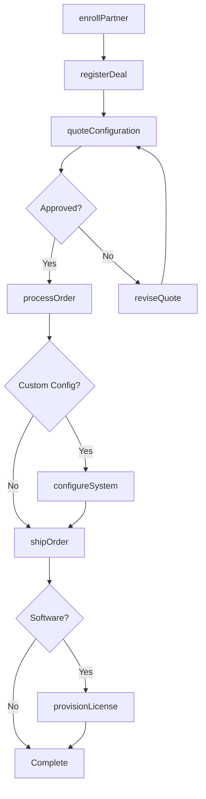
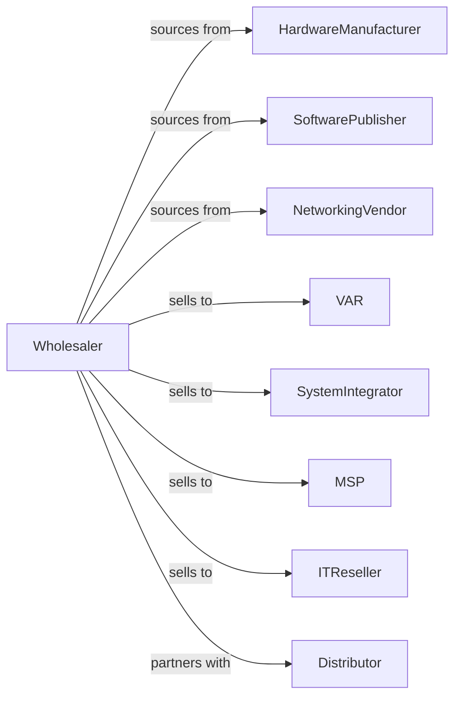

# Computer and Computer Peripheral Equipment and Software Merchant Wholesalers

> Business-as-Code definition for IT hardware and software wholesale distribution. Models procurement, VAR programs, and fulfillment for computers, peripherals, and software.

## Overview

Computer equipment wholesalers distribute servers, workstations, laptops, networking equipment, storage systems, and software licenses to VARs, system integrators, and IT resellers. This definition exposes actions for product sourcing, channel partner management, and configuration services with events for product lifecycle and demand optimization.

## Actors

| Actor | Description |
|-------|-------------|
| HardwareManufacturer | Produces computers and peripherals |
| SoftwarePublisher | Provides software licenses and subscriptions |
| NetworkingVendor | Makes routers, switches, and infrastructure |
| VAR | Value-added reseller integrating solutions |
| SystemIntegrator | Builds custom IT solutions |
| MSP | Managed service provider |
| ITReseller | Technology product reseller |
| Distributor | Broadline or specialized tech distributor |

## Roles

| Role | Description |
|------|-------------|
| VendorManager | Manages manufacturer relationships |
| ChannelAccountManager | Serves VAR and integrator partners |
| TechnicalArchitect | Provides pre-sales technical design |
| LicensingSpecialist | Handles software licensing programs |
| LogisticsManager | Oversees fulfillment operations |
| ConfigurationEngineer | Builds and images custom hardware configurations before shipment |

## Entities

| Entity | Description |
|--------|-------------|
| Product | Hardware or software item |
| Inventory | Stock levels across locations |
| PurchaseOrder | Order placed with vendor |
| SalesOrder | Partner or customer order |
| PartnerProgram | VAR or reseller agreement |
| License | Software license or subscription |
| Configuration | Custom hardware build specification |
| Quote | Price quotation for solution |
| RMA | Return merchandise authorization |
| Rebate | Partner volume incentive |
| Deal | Registered opportunity |

## Actions

| Action | Description |
|--------|-------------|
| sourceProduct | Identify and onboard vendor lines |
| placeOrder | Submit purchase order to vendor |
| receiveInventory | Check in incoming products |
| stockWarehouse | Store products in locations |
| enrollPartner | Authorize new channel partner |
| registerDeal | Log partner opportunity |
| quoteConfiguration | Price custom solution |
| configureSystem | Build custom hardware configuration |
| processOrder | Fulfill partner order |
| shipOrder | Dispatch products to partner |
| provisionLicense | Activate software licenses |
| processRMA | Handle defective returns |
| claimRebate | Submit partner volume rebate |
| forecastDemand | Project product requirements |

## Events

| Event | Description |
|-------|-------------|
| orderReceived | Partner placed order |
| inventoryReceived | Vendor shipment arrived |
| systemConfigured | Custom build completed |
| orderShipped | Products dispatched |
| orderDelivered | Partner received shipment |
| licenseProvisioned | Software activated |
| dealRegistered | Opportunity logged |
| dealWon | Registered opportunity closed |
| partnerEnrolled | New partner authorized |
| rebateEarned | Volume threshold achieved |
| productEOL | Product end-of-life announced |
| stockLow | Inventory below threshold |

## Searches

| Search | Description |
|--------|-------------|
| findProducts | Search by category, vendor, specs |
| getInventory | Check stock levels |
| getOrders | Retrieve orders by status |
| getPartners | Search channel partners |
| getDeals | Track registered opportunities |
| getLicenses | List active software licenses |
| getRebates | Check rebate status |

## Workflow



## Actor Relationships



## Usage

### Calling Actions

```typescript
import { wholesaleComputerComputer } from '@headlessly/wholesale-computer-computer'

const wholesaler = wholesaleComputerComputer()

// Search server products
const servers = await wholesaler.findProducts({
  category: 'rack-server',
  vendor: 'dell',
  processors: { min: 2 }
})

// Quote custom configuration
const quote = await wholesaler.quoteConfiguration({
  partnerId: 'var-789',
  baseProduct: servers[0].id,
  config: {
    memory: '256GB',
    storage: '8x2TB-NVMe',
    network: '4x25GbE'
  },
  dealId: 'deal-456'
})

// Process order with licensing
await wholesaler.processOrder({
  partnerId: 'var-789',
  items: [{ configId: quote.configId, quantity: 5 }],
  licenses: [
    { sku: 'VMWARE-VSPHERE-ENT', quantity: 5 }
  ]
})
```

### Event-Driven Automation

```typescript
// Provision licenses on delivery
wholesaler.orderDelivered(async ({ orderId, licenses }) => {
  for (const license of licenses) {
    await wholesaler.provisionLicense({
      orderId,
      licenseId: license.id,
      activationKey: generateKey()
    })
  }
})

// Claim rebates automatically
wholesaler.rebateEarned(async ({ partnerId, vendorId, amount }) => {
  await wholesaler.claimRebate({
    partnerId,
    vendorId,
    amount,
    period: getCurrentQuarter()
  })
})
```
