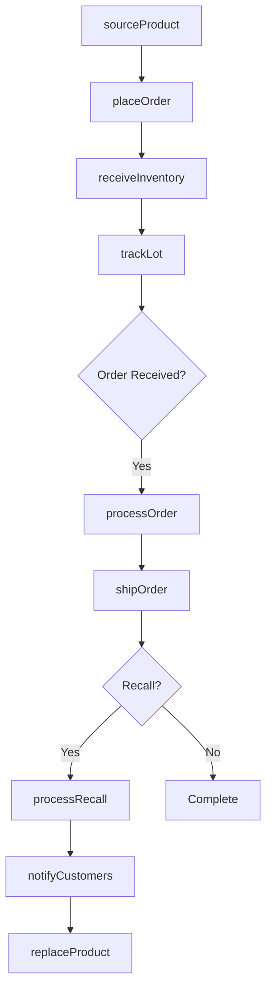
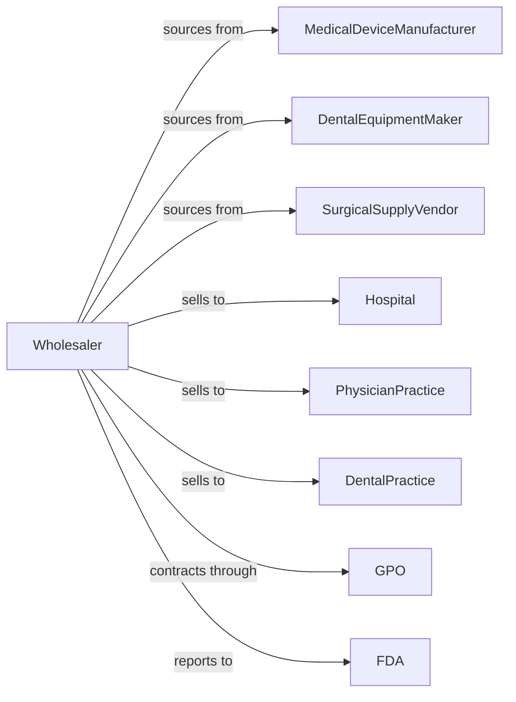

# Medical, Dental, and Hospital Equipment and Supplies Merchant Wholesalers

> Business-as-Code definition for medical equipment wholesale distribution. Models procurement, regulatory compliance, and healthcare provider fulfillment.

## Overview

Medical equipment wholesalers distribute diagnostic equipment, surgical instruments, patient monitoring systems, hospital beds, dental equipment, and medical supplies to hospitals, clinics, and healthcare providers. This definition exposes actions for product sourcing, compliance tracking, and contract management with events for recalls and inventory optimization.

## Actors

| Actor | Description |
|-------|-------------|
| MedicalDeviceManufacturer | Produces diagnostic and therapeutic equipment |
| DentalEquipmentMaker | Manufactures dental chairs and instruments |
| SurgicalSupplyVendor | Provides surgical instruments and supplies |
| Hospital | Acute care healthcare facility |
| PhysicianPractice | Medical group or clinic |
| DentalPractice | Dental office or group |
| GPO | Group purchasing organization |
| FDA | Regulatory oversight agency |

## Roles

| Role | Description |
|------|-------------|
| ProductSpecialist | Expert in specific equipment categories |
| AccountManager | Serves healthcare provider accounts |
| ComplianceOfficer | Ensures regulatory adherence |
| ContractManager | Manages GPO and provider agreements |
| BiomedTechnician | Provides equipment service and calibration |
| SterileProcessRep | Advises on sterilization equipment and infection control protocols |

## Entities

| Entity | Description |
|--------|-------------|
| Product | Medical equipment or supply item |
| Inventory | Stock levels with lot tracking |
| PurchaseOrder | Order placed with manufacturer |
| SalesOrder | Customer order for products |
| Contract | GPO or provider purchase agreement |
| Lot | Batch with expiration and tracking |
| UDI | Unique device identifier |
| Recall | FDA recall notification |
| ServiceRecord | Equipment maintenance history |
| Certification | Equipment calibration or certification |
| Quote | Price quotation for equipment |

## Actions

| Action | Description |
|--------|-------------|
| sourceProduct | Identify and qualify vendors |
| placeOrder | Submit purchase order to manufacturer |
| receiveInventory | Check in with lot tracking |
| stockWarehouse | Store with proper conditions |
| enrollContract | Add customer to GPO agreement |
| quoteEquipment | Price equipment for customer |
| processOrder | Fulfill healthcare provider order |
| shipOrder | Dispatch with required documentation |
| trackLot | Monitor lot expiration and location |
| processRecall | Handle FDA recall notification |
| calibrateEquipment | Perform required calibrations |
| certifyEquipment | Complete certification requirements |
| handleReturn | Process returns with compliance |
| reportSales | Submit required regulatory reports |

## Events

| Event | Description |
|-------|-------------|
| orderReceived | Customer placed order |
| inventoryReceived | Shipment arrived with lot info |
| orderShipped | Products dispatched |
| orderDelivered | Customer received products |
| contractEnrolled | Customer added to agreement |
| recallIssued | FDA announced product recall |
| recallCompleted | Recall actions finished |
| lotExpiring | Lot approaching expiration |
| calibrationDue | Equipment needs calibration |
| certificationExpiring | Certification needs renewal |
| stockLow | Inventory below threshold |
| complianceAlert | Regulatory requirement flagged |

## Searches

| Search | Description |
|--------|-------------|
| findProducts | Search by category, UDI, specs |
| getInventory | Check stock with lot details |
| getOrders | Retrieve orders by status |
| getContracts | List active agreements |
| getLots | Track lots by expiration |
| getRecalls | Access active recalls |
| getCalibrations | View calibration schedule |

## Workflow



## Actor Relationships



## Usage

### Calling Actions

```typescript
import { wholesaleMedical } from '@headlessly/wholesale-medical'

const wholesaler = wholesaleMedical()

// Search medical equipment
const monitors = await wholesaler.findProducts({
  category: 'patient-monitor',
  parameters: ['ecg', 'spo2', 'nibp'],
  portable: true
})

// Process hospital order with lot tracking
const order = await wholesaler.processOrder({
  customerId: 'hospital-456',
  contractId: 'gpo-premier-2024',
  items: [
    { productId: monitors[0].id, quantity: 10 }
  ],
  lotPreference: 'longest-expiration'
})

// Track lot information
await wholesaler.trackLot({
  lotNumber: order.lots[0].number,
  locations: ['hospital-456'],
  expirationAlert: 90
})
```

### Event-Driven Automation

```typescript
// Handle FDA recalls
wholesaler.recallIssued(async ({ productId, lotNumbers, severity }) => {
  const affectedOrders = await wholesaler.getOrders({
    productId,
    lots: lotNumbers
  })

  for (const order of affectedOrders) {
    await notifyCustomer({
      customerId: order.customerId,
      severity,
      action: severity === 'Class I' ? 'immediate-return' : 'stop-use'
    })
  }
})

// Alert on expiring lots
wholesaler.lotExpiring(async ({ lotNumber, daysRemaining }) => {
  if (daysRemaining <= 30) {
    await wholesaler.createPromotion({
      lotNumber,
      discount: 25,
      reason: 'short-dated'
    })
  }
})
```
