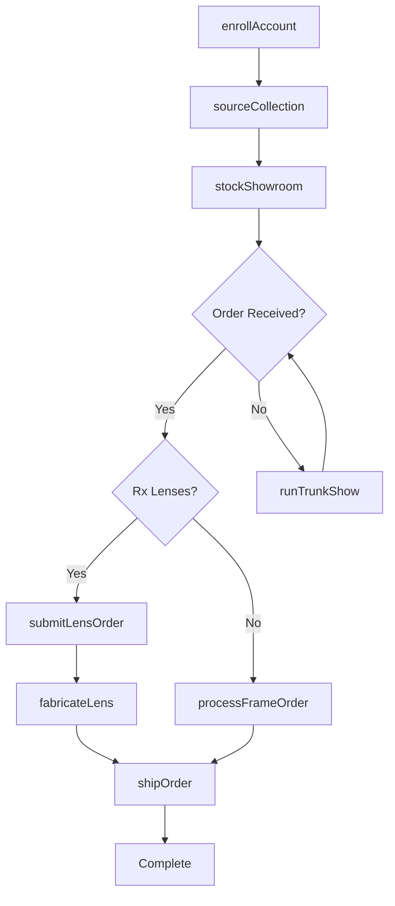
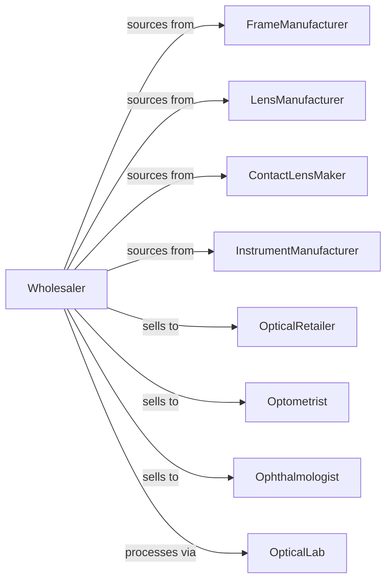

# Ophthalmic Goods Merchant Wholesalers

> Business-as-Code definition for ophthalmic goods wholesale distribution. Models procurement, optical lab operations, and eye care professional fulfillment.

## Overview

Ophthalmic goods wholesalers distribute eyeglass frames, lenses, contact lenses, optometric instruments, and sunglasses to optical retailers, optometry practices, and ophthalmology clinics. This definition exposes actions for product sourcing, lens processing, and practice fulfillment with events for fashion trends and inventory optimization.

## Actors

| Actor | Description |
|-------|-------------|
| FrameManufacturer | Produces eyeglass frames |
| LensManufacturer | Makes prescription and stock lenses |
| ContactLensMaker | Produces contact lens products |
| InstrumentManufacturer | Makes optometric equipment |
| OpticalRetailer | Eyewear retail chain or store |
| Optometrist | Eye care professional practice |
| Ophthalmologist | Medical eye care practice |
| OpticalLab | Prescription lens fabrication facility |

## Roles

| Role | Description |
|------|-------------|
| FrameBuyer | Sources frame collections |
| LensSpecialist | Expert in lens products and processing |
| AccountManager | Serves optical accounts |
| LabManager | Oversees lens fabrication |
| TrendAnalyst | Tracks eyewear fashion trends |
| Edger | Cuts, grinds, and finishes prescription lenses to fit frames in the optical lab |

## Entities

| Entity | Description |
|--------|-------------|
| Frame | Eyeglass frame with style and specs |
| Lens | Prescription or stock lens product |
| ContactLens | Contact lens product line |
| Instrument | Optometric diagnostic equipment |
| Inventory | Stock levels by product category |
| PurchaseOrder | Order placed with manufacturer |
| SalesOrder | Customer order for products |
| Prescription | Patient lens prescription |
| Collection | Frame brand or seasonal collection |
| FabOrder | Lens fabrication work order |
| Warranty | Frame or lens warranty |

## Actions

| Action | Description |
|--------|-------------|
| sourceCollection | Identify and onboard frame lines |
| placeOrder | Submit purchase order to manufacturer |
| receiveInventory | Check in incoming products |
| stockShowroom | Display frames for selection |
| enrollAccount | Authorize new optical account |
| processFrameOrder | Fulfill frame orders |
| submitLensOrder | Send prescription to lab |
| fabricateLens | Process lens to prescription |
| shipOrder | Dispatch completed order |
| handleWarranty | Process frame or lens warranty |
| trackTrends | Monitor fashion and sales trends |
| runTrunkShow | Host in-office frame event |
| returnDefective | Process manufacturer returns |
| forecastDemand | Project product requirements |

## Events

| Event | Description |
|-------|-------------|
| orderReceived | Customer placed order |
| inventoryReceived | Manufacturer shipment arrived |
| lensOrderSubmitted | Prescription sent to lab |
| lensFabricated | Prescription lens completed |
| orderShipped | Products dispatched |
| orderDelivered | Customer received products |
| collectionLaunched | New frame line available |
| warrantyRequested | Customer filed warranty claim |
| trendIdentified | New style trend detected |
| accountEnrolled | New optical account authorized |
| stockLow | Inventory below threshold |
| trunkShowScheduled | Frame event confirmed |

## Searches

| Search | Description |
|--------|-------------|
| findFrames | Search by brand, style, material |
| findLenses | Search by type, coating, material |
| getInventory | Check stock levels |
| getOrders | Retrieve orders by status |
| getAccounts | Search optical accounts |
| getCollections | Browse frame collections |
| getFabOrders | Track lens fabrication orders |

## Workflow



## Actor Relationships



## Usage

### Calling Actions

```typescript
import { wholesaleOphthalmicGoods } from '@headlessly/wholesale-ophthalmic-goods'

const wholesaler = wholesaleOphthalmicGoods()

// Search designer frames
const frames = await wholesaler.findFrames({
  brand: 'ray-ban',
  style: 'aviator',
  material: 'metal'
})

// Process frame and lens order
const order = await wholesaler.processFrameOrder({
  accountId: 'optical-123',
  frames: [
    { sku: 'RB-AVI-GLD-58', quantity: 6 }
  ]
})

// Submit lens prescription
await wholesaler.submitLensOrder({
  orderId: order.id,
  prescription: {
    rightSphere: -2.25,
    rightCylinder: -0.75,
    rightAxis: 180,
    leftSphere: -2.00,
    leftCylinder: -0.50,
    leftAxis: 175,
    pd: 64
  },
  lensType: 'progressive',
  coating: ['anti-reflective', 'blue-light']
})
```

### Event-Driven Automation

```typescript
// Notify on lens completion
wholesaler.lensFabricated(async ({ orderId, accountId }) => {
  await wholesaler.shipOrder({ orderId })

  await notifyAccount({
    accountId,
    message: `Order ${orderId} shipped - lenses complete`
  })
})

// Schedule trunk shows on new collections
wholesaler.collectionLaunched(async ({ collectionId, brand }) => {
  const accounts = await wholesaler.getAccounts({
    brands: [brand],
    tier: 'premium'
  })

  for (const account of accounts) {
    await wholesaler.runTrunkShow({
      accountId: account.id,
      collectionId,
      scheduleDays: 30
    })
  }
})
```
