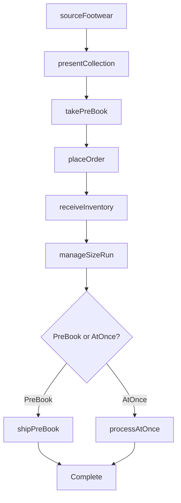
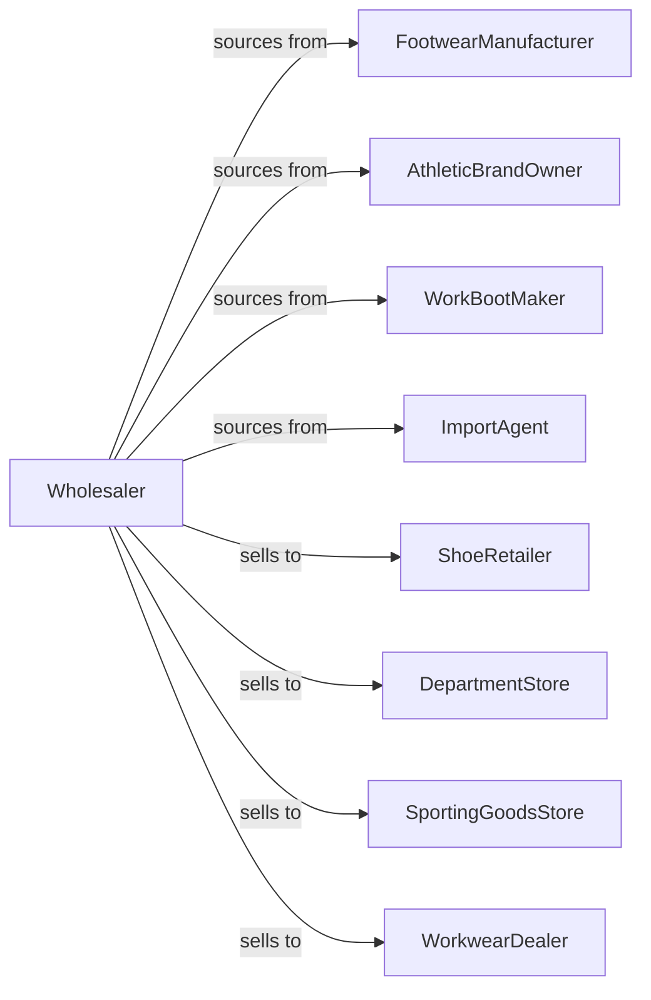

# Footwear Merchant Wholesalers

> Business-as-Code definition for footwear wholesale distribution. Models shoe sourcing, seasonal collection management, and retail fulfillment for dress, casual, athletic, and work footwear.

## Overview

Footwear wholesalers distribute shoes, boots, sandals, and athletic footwear to shoe retailers, department stores, and specialty shops. This definition exposes actions for product sourcing, seasonal buying, and size-run management with events for fashion trends and inventory optimization.

## Actors

| Actor | Description |
|-------|-------------|
| FootwearManufacturer | Produces shoes and boots |
| AthleticBrandOwner | Creates athletic footwear |
| WorkBootMaker | Manufactures safety and work footwear |
| ImportAgent | Sources footwear from overseas |
| ShoeRetailer | Sells footwear to consumers |
| DepartmentStore | Retails footwear in shoe departments |
| SportingGoodsStore | Sells athletic footwear |
| WorkwearDealer | Specializes in safety footwear |

## Roles

| Role | Description |
|------|-------------|
| FootwearBuyer | Sources shoes from manufacturers |
| SalesRepresentative | Serves retail accounts |
| SeasonalPlanner | Coordinates collection timing |
| InventoryAnalyst | Manages size-run optimization |
| ShowroomManager | Operates sample showroom |

## Entities

| Entity | Description |
|--------|-------------|
| Footwear | Shoe product with style and specs |
| Inventory | Stock levels by style-size-color |
| PurchaseOrder | Order placed with manufacturer |
| SalesOrder | Customer order |
| SizeRun | Size distribution for style |
| Collection | Seasonal footwear grouping |
| Sample | Display shoe for showroom |
| PreBook | Advance seasonal order |
| AtOnce | Immediate fill order |
| Quote | Price quotation |
| Return | Customer return authorization |

## Actions

| Action | Description |
|--------|-------------|
| sourceFootwear | Contract with manufacturers |
| importProduct | Manage overseas shipments |
| placeOrder | Submit purchase order |
| receiveInventory | Check in footwear shipments |
| stockWarehouse | Store by style-size-color |
| presentCollection | Show seasonal line to retailers |
| takePreBook | Accept advance season orders |
| processAtOnce | Fill immediate orders |
| shipOrder | Dispatch footwear |
| manageSizeRun | Optimize size distribution |
| processReturn | Handle customer returns |
| markdownProduct | Reduce prices on slow sellers |
| forecastSeasonal | Project seasonal demand |
| trackTrends | Monitor footwear fashion |

## Events

| Event | Description |
|-------|-------------|
| orderReceived | Customer placed order |
| inventoryReceived | Manufacturer shipment arrived |
| orderShipped | Products dispatched |
| orderDelivered | Customer received products |
| collectionPresented | Seasonal line shown |
| preBookCompleted | Advance orders finalized |
| trendIdentified | Fashion direction noted |
| sizeRunIssueDetected | Size distribution problem |
| styleDiscontinued | Product ending production |
| stockDepleted | Inventory fell below reorder level |
| markdownApplied | Price reduction taken |
| seasonEnded | Selling season closed |

## Searches

| Search | Description |
|--------|-------------|
| findFootwear | Search by style, size, color |
| getInventory | Check stock by style-size-color |
| getOrders | Retrieve orders by status |
| getCollections | View seasonal lines |
| getPreBooks | Track advance orders |
| getSizeRuns | Access size distribution data |
| getCustomers | List retail accounts |

## Workflow



## Actor Relationships



## Usage

### Calling Actions

```typescript
import { wholesaleFootwear } from '@headlessly/wholesale-footwear'

const wholesaler = wholesaleFootwear()

// Search footwear inventory
const shoes = await wholesaler.findFootwear({
  category: 'dress',
  gender: 'mens',
  style: 'oxford',
  material: 'leather',
  color: 'black'
})

// Present collection to retailer
const presentation = await wholesaler.presentCollection({
  retailerId: 'shoe-store-456',
  collection: 'fall-2024',
  categories: ['dress', 'casual', 'boots'],
  showroomDate: '2024-03-15'
})

// Take pre-book order
await wholesaler.takePreBook({
  retailerId: 'shoe-store-456',
  collection: 'fall-2024',
  items: [
    {
      styleId: shoes[0].id,
      sizeRun: { 8: 2, 9: 3, 10: 4, 11: 3, 12: 2 },
      colors: ['black', 'brown']
    }
  ],
  shipWindow: { start: '2024-08-01', end: '2024-08-15' }
})
```

### Event-Driven Automation

```typescript
// Optimize size runs based on sales
wholesaler.orderShipped(async ({ orderId, items }) => {
  for (const item of items) {
    await updateSizeVelocity({
      styleId: item.styleId,
      sizesSold: item.sizes
    })
  }

  const recommendations = await analyzeSizeRuns()
  await notifyBuyers({ sizeRunRecommendations: recommendations })
})

// Markdown slow sellers at season end
wholesaler.seasonEnded(async ({ season, weeksRemaining }) => {
  if (weeksRemaining === 4) {
    const slowSellers = await identifySlowSellers(season)

    for (const style of slowSellers) {
      await wholesaler.markdownProduct({
        styleId: style.id,
        discount: calculateMarkdown(style.weeksOnHand)
      })
    }
  }
})
```
