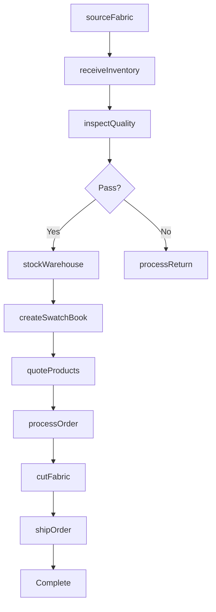
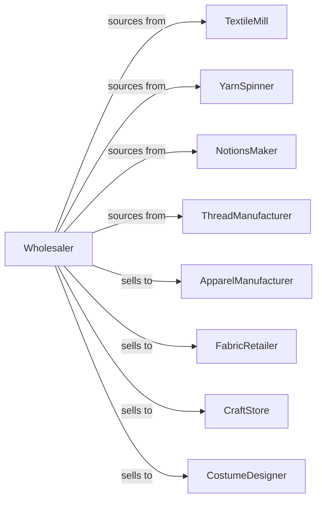

# Piece Goods, Notions, and Other Dry Goods Merchant Wholesalers

> Business-as-Code definition for fabric and notions wholesale distribution. Models textile sourcing, apparel manufacturing support, and craft retail fulfillment for piece goods, threads, and sewing notions.

## Overview

Piece goods and notions wholesalers distribute fabrics, yarns, threads, zippers, buttons, and sewing accessories to apparel manufacturers, fabric retailers, and craft stores. This definition exposes actions for textile sourcing, pattern coordination, and seasonal collection support with events for fashion trends and inventory management.

## Actors

| Actor | Description |
|-------|-------------|
| TextileMill | Manufactures woven and knit fabrics |
| YarnSpinner | Produces knitting and craft yarns |
| NotionsMaker | Manufactures zippers, buttons, and trims |
| ThreadManufacturer | Produces sewing and embroidery thread |
| ApparelManufacturer | Creates garments from textiles |
| FabricRetailer | Sells fabric to consumers |
| CraftStore | Retails craft and sewing supplies |
| CostumeDesigner | Creates theatrical and specialty garments |

## Roles

| Role | Description |
|------|-------------|
| TextileBuyer | Sources fabrics from mills |
| SalesRepresentative | Serves manufacturing and retail accounts |
| PatternCoordinator | Aligns fabrics with fashion seasons |
| QualityInspector | Checks fabric quality and defects |
| WarehouseManager | Oversees inventory operations |

## Entities

| Entity | Description |
|--------|-------------|
| Fabric | Textile material by type and composition |
| Yarn | Knitting or craft yarn product |
| Notion | Sewing accessory or trim |
| Inventory | Stock levels by item |
| PurchaseOrder | Order placed with mill or manufacturer |
| SalesOrder | Customer order |
| Bolt | Fabric roll measurement |
| SwatchBook | Fabric sample collection |
| Collection | Seasonal fabric grouping |
| Quote | Price quotation |
| Return | Customer return authorization |

## Actions

| Action | Description |
|--------|-------------|
| sourceFabric | Contract with textile mills |
| sourceNotions | Onboard notion manufacturers |
| placeOrder | Submit purchase order to supplier |
| receiveInventory | Check in with quality inspection |
| stockWarehouse | Store fabrics and notions |
| createSwatchBook | Assemble fabric samples |
| quoteProducts | Price fabrics and notions |
| processOrder | Fulfill customer order |
| cutFabric | Cut fabric from bolts |
| shipOrder | Dispatch products |
| coordinateCollection | Align seasonal fabrics |
| trackTrends | Monitor fashion directions |
| processReturn | Handle customer returns |
| inspectQuality | Check fabric for defects |

## Events

| Event | Description |
|-------|-------------|
| orderReceived | Customer placed order |
| inventoryReceived | Supplier shipment arrived |
| orderShipped | Products dispatched |
| orderDelivered | Customer received products |
| swatchBookCreated | Sample collection assembled |
| collectionLaunched | Seasonal fabrics released |
| trendIdentified | Fashion direction noted |
| qualityIssueDetected | Fabric defect detected |
| fabricDiscontinued | Textile ending production |
| stockDepleted | Inventory fell below reorder level |
| seasonChanged | Fashion season shifted |
| returnProcessed | Return completed |

## Searches

| Search | Description |
|--------|-------------|
| findFabrics | Search by type, composition, color |
| findNotions | Search by category, size, color |
| getInventory | Check stock levels |
| getOrders | Retrieve orders by status |
| getSwatchBooks | Access sample collections |
| getCollections | View seasonal groupings |
| getCustomers | List manufacturing and retail accounts |

## Workflow



## Actor Relationships



## Usage

### Calling Actions

```typescript
import { wholesalePieceGoods } from '@headlessly/wholesale-piece-goods'

const wholesaler = wholesalePieceGoods()

// Search fabric inventory
const fabrics = await wholesaler.findFabrics({
  type: 'cotton',
  weave: 'twill',
  weight: { min: 6, max: 10, unit: 'oz' },
  width: 60,
  color: 'navy'
})

// Create swatch book for manufacturer
const swatchBook = await wholesaler.createSwatchBook({
  customerId: 'apparel-mfr-456',
  collection: 'spring-2024',
  fabrics: fabrics.map(f => f.id),
  purpose: 'sample-review'
})

// Process fabric order
await wholesaler.processOrder({
  customerId: 'apparel-mfr-456',
  items: [
    { fabricId: fabrics[0].id, quantity: 500, unit: 'yards' },
    { notionId: 'ZIPPER-22-BRASS', quantity: 1000 }
  ],
  cutInstructions: {
    fabric: { rollSize: 50 }
  }
})
```

### Event-Driven Automation

```typescript
// Track fashion trends for buyers
wholesaler.trendIdentified(async ({ trend, season, colors }) => {
  const relevantFabrics = await wholesaler.findFabrics({
    colors,
    availableFor: season
  })

  await notifyBuyers({
    trend,
    recommendedFabrics: relevantFabrics
  })
})

// Alert on fabric discontinuation
wholesaler.fabricDiscontinued(async ({ fabricId, finalOrderDate }) => {
  const customers = await getCustomersUsingFabric(fabricId)

  for (const customer of customers) {
    await notifyCustomer({
      customerId: customer.id,
      message: `Fabric ${fabricId} discontinuing. Final orders by ${finalOrderDate}`
    })
  }
})
```
