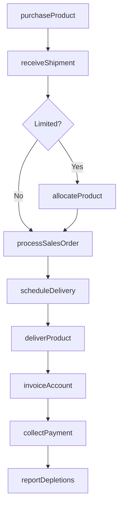
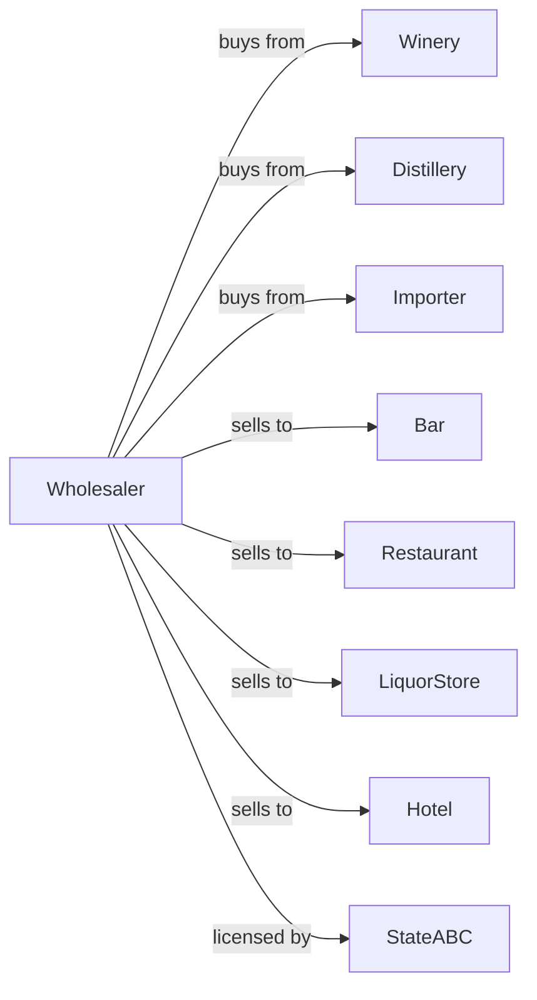

# Wine and Distilled Alcoholic Beverage Merchant Wholesalers

> Business-as-Code definition for wine and spirits wholesale distribution operations. Models the complete three-tier distribution from wineries and distilleries through licensed retail accounts.

## Overview

Wine and distilled beverage merchant wholesalers distribute wines, spirits, liqueurs, and neutral spirits to bars, restaurants, liquor stores, and hotels. This definition exposes actions for product procurement, temperature-controlled storage, territory coverage, and regulatory compliance with events for automated inventory management and allocation optimization.

## Actors

| Actor | Description |
|-------|-------------|
| Winery | Domestic or international wine producer |
| Distillery | Spirits producer supplying whiskey, vodka, gin, etc |
| Importer | Brings international wines and spirits to market |
| Bar | On-premise retailer serving cocktails and wine |
| Restaurant | Foodservice establishment with wine and spirits program |
| LiquorStore | Off-premise package store selling wine and spirits |
| Hotel | Hospitality venue with beverage operations |
| StateABC | State alcohol control board regulating distribution |

## Roles

| Role | Description |
|------|-------------|
| SalesRepresentative | Manages retail accounts and builds programs |
| WineSpecialist | Provides expertise on wine selection and pairings |
| TerritoryManager | Oversees sales team and market development |
| WarehouseManager | Manages climate-controlled storage operations |
| DeliveryDriver | Operates delivery vehicles to retail accounts |
| ComplianceOfficer | Ensures licensing and regulatory compliance |
| Sommelier | Provides expert wine tasting, selection, and pairing guidance to restaurant accounts |

## Entities

| Entity | Description |
|--------|-------------|
| Product | Wine or spirits SKU with producer, vintage, and size |
| Inventory | Current stock by product and warehouse location |
| RetailAccount | Licensed bar, restaurant, or store |
| SalesOrder | Customer order specifying products and quantities |
| Allocation | Limited availability product distribution |
| DeliveryRoute | Optimized sequence of delivery stops |
| Invoice | Billing document for delivered product |
| PriceList | Current pricing by product and account type |
| Promotion | Deal or sampling program from supplier |
| WineList | Restaurant wine menu featuring portfolio |

## Actions

| Action | Description |
|--------|-------------|
| purchaseProduct | Order wine or spirits from producer or importer |
| receiveShipment | Accept delivery into climate-controlled storage |
| allocateProduct | Distribute limited availability items to accounts |
| processSalesOrder | Pick, stage, and prepare customer order |
| scheduleDelivery | Plan delivery route and assign driver |
| deliverProduct | Transport and deliver to retail account |
| invoiceAccount | Generate billing for delivered product |
| collectPayment | Process payment from retail account |
| conductTasting | Host sampling event at retail account |
| buildWineList | Develop wine program with restaurant |
| runPromotion | Execute supplier promotional program |
| reportDepletions | Submit sales data to suppliers |

## Events

| Event | Description |
|-------|-------------|
| shipmentReceived | Wine or spirits arrived from supplier |
| productStored | Inventory placed in climate-controlled storage |
| allocationReleased | Limited product available for distribution |
| orderReceived | Retail account submitted order |
| orderDelivered | Products delivered to account |
| invoiceSent | Billing transmitted to customer |
| paymentReceived | Account payment processed |
| inventoryLow | Stock fell below reorder point |
| vintageExhausted | Last of vintage sold out |
| promotionStarted | Supplier promotion activated |
| tastingScheduled | Sampling event confirmed |
| wineListPlaced | Restaurant menu placement achieved |

## Searches

| Search | Description |
|--------|-------------|
| findProducts | Search catalog by producer, varietal, or region |
| getInventory | Check stock levels by product and warehouse |
| getAccounts | Search retail accounts by type or territory |
| getOrders | Retrieve orders by account, status, or date |
| getAllocations | View limited product availability |
| getPromotions | View active supplier promotions |
| getSalesHistory | Retrieve account sales and program performance |

## Workflow



## Actor Relationships



## Usage

### Calling Actions

```typescript
import { distributeWineSpirits } from '@headlessly/distribute-wine-spirits'

const distributor = distributeWineSpirits()

// Search catalog by producer, varietal, or region
const findProductsResult = await distributor.findProducts({ category: 'featured', inStock: true })

// Check stock levels by product and warehouse
const getInventoryResult = await distributor.getInventory({ status: 'available', category: 'main' })

// Purchase from winery
const order = await distributor.purchaseProduct({
  supplierId: 'napa-valley-winery',
  products: [
    { sku: 'cabernet-2021', quantity: 50, unit: 'case' },
    { sku: 'chardonnay-2022', quantity: 30, unit: 'case' }
  ],
  deliveryDate: '2024-02-15'
})

// Allocate limited release
await distributor.allocateProduct({
  productId: 'reserve-cabernet-2019',
  totalCases: 25,
  allocations: [
    { accountId: 'fine-dining-rest', cases: 3 },
    { accountId: 'wine-bar-downtown', cases: 2 },
    { accountId: 'premium-wine-shop', cases: 5 }
  ]
})

// Conduct tasting
await distributor.conductTasting({
  accountId: 'upscale-restaurant',
  products: ['cabernet-2021', 'chardonnay-2022', 'pinot-2021'],
  attendees: ['sommelier', 'owner', 'bar-manager'],
  date: '2024-02-20'
})
```

### Event-Driven Automation

```typescript
// Auto-notify on allocation release
distributor.allocationReleased(async ({ productId, totalCases, releaseDate }) => {
  const topAccounts = await distributor.getAccounts({ tier: 'platinum' })
  for (const account of topAccounts) {
    await notifyAccount({
      accountId: account.id,
      message: `Limited allocation of ${productId} now available`
    })
  }
})

// Auto-reorder on low inventory
distributor.inventoryLow(async ({ productId, currentStock }) => {
  const product = await getProductDetails(productId)
  if (!product.isLimited) {
    await distributor.purchaseProduct({
      supplierId: product.supplierId,
      products: [{ sku: productId, quantity: 50 }]
    })
  }
})
```
