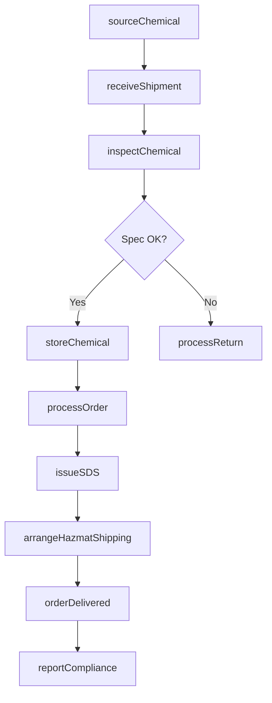
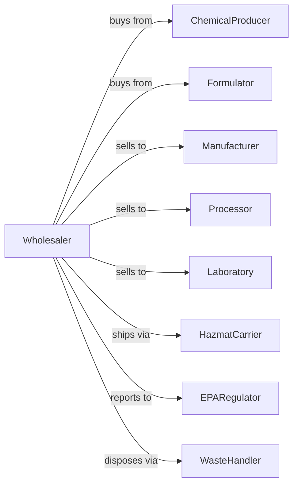

# Other Chemical and Allied Products Merchant Wholesalers

> Business-as-Code definition for industrial chemical wholesale distribution operations. Models the complete supply chain for acids, solvents, dyes, and specialty chemicals.

## Overview

Other chemical merchant wholesalers distribute industrial chemicals including acids, solvents, dyes, surfactants, and specialty compounds to manufacturers, processors, and industrial users. This definition exposes actions for chemical procurement, hazmat compliance, inventory management, and order fulfillment with events for automated safety monitoring and regulatory compliance.

## Actors

| Actor | Description |
|-------|-------------|
| ChemicalProducer | Manufacturer of industrial chemicals and compounds |
| Formulator | Produces custom blends and specialty formulations |
| Manufacturer | Industrial buyer using chemicals in production |
| Processor | Chemical user in water treatment, metal finishing, etc |
| Laboratory | Research or QC facility purchasing analytical chemicals |
| HazmatCarrier | Certified transporter of hazardous materials |
| EPARegulator | Environmental Protection Agency oversight |
| WasteHandler | Processes chemical waste and containers |

## Roles

| Role | Description |
|------|-------------|
| ProductManager | Manages chemical lines and supplier relationships |
| ChemicalEngineer | Provides technical support and formulation advice |
| SalesRepresentative | Manages customer accounts and negotiates contracts |
| WarehouseManager | Oversees hazmat storage and inventory operations |
| ComplianceOfficer | Ensures regulatory and safety compliance |
| LogisticsCoordinator | Arranges hazmat transport and documentation |

## Entities

| Entity | Description |
|--------|-------------|
| Chemical | Product with CAS number, specs, and hazard class |
| Inventory | Current stock by chemical, grade, and container |
| PurchaseOrder | Customer order specifying chemicals and quantities |
| SafetyDataSheet | SDS document for hazard communication |
| Certificate | COA documenting purity and specifications |
| Container | Drum, tote, or bulk tank with tracking |
| HazmatManifest | Shipping document for regulated materials |
| PriceList | Current pricing by chemical and volume tier |
| StorageLocation | Designated area meeting hazard requirements |
| ComplianceRecord | Documentation for regulatory reporting |

## Actions

| Action | Description |
|--------|-------------|
| sourceChemical | Procure chemicals from producers or formulators |
| receiveShipment | Accept delivery with hazmat verification |
| inspectChemical | Verify quality and specification compliance |
| storeChemical | Place in appropriate hazmat storage area |
| processOrder | Pick, pack, and prepare customer order |
| priceChemical | Set pricing based on market and volume |
| arrangeHazmatShipping | Schedule certified hazmat transport |
| provideTechSupport | Assist with chemical selection and application |
| issueSDS | Provide safety data sheets to customers |
| processReturn | Handle off-spec or damaged chemical returns |
| reportCompliance | Submit regulatory reports to agencies |
| manageWaste | Handle empty containers and waste chemicals |

## Events

| Event | Description |
|-------|-------------|
| shipmentReceived | Chemical arrived from supplier |
| chemicalInspected | Quality verification completed |
| chemicalStored | Product placed in hazmat storage |
| orderReceived | Customer purchase order submitted |
| orderShipped | Hazmat delivery departed |
| orderDelivered | Customer confirmed receipt |
| inventoryDepleted | Stock fell below reorder level |
| priceChanged | Market or supplier pricing updated |
| sdsUpdated | Safety data sheet revised |
| complianceViolationDetected | Compliance violation or expiration detected |
| spillIncidentOccurred | Chemical spill or release occurred |
| containerReturned | Empty container received for disposal |

## Searches

| Search | Description |
|--------|-------------|
| findChemicals | Search catalog by name, CAS number, or application |
| getInventory | Check stock levels by chemical and location |
| getOrders | Retrieve orders by customer, status, or date |
| trackShipment | Get hazmat delivery status |
| findSuppliers | Search suppliers by chemical or specialty |
| getSDS | Retrieve safety data sheets |
| getComplianceRecords | View regulatory filings and reports |

## Workflow



## Actor Relationships



## Usage

### Calling Actions

```typescript
import { wholesaleChemicals } from '@headlessly/wholesale-chemicals'

const distributor = wholesaleChemicals()

// Search catalog by name, CAS number, or application
const findChemicalsResult = await distributor.findChemicals({ status: 'active' })

// Check stock levels by chemical and location
const getInventoryResult = await distributor.getInventory({ status: 'available', category: 'main' })

// Source chemical from producer
const shipment = await distributor.sourceChemical({
  supplierId: 'basf-corp',
  chemical: 'sulfuric-acid',
  grade: 'technical',
  quantity: 55,
  unit: 'gal',
  packaging: 'drum',
  hazardClass: '8'
})

// Process customer order
await distributor.processOrder({
  customerId: 'midwest-plating',
  items: [
    { chemicalId: 'sulfuric-acid-tech', quantity: 10, unit: 'drum' },
    { chemicalId: 'sodium-hydroxide-50', quantity: 5, unit: 'drum' }
  ],
  deliveryDate: '2024-02-15'
})

// Arrange hazmat shipping
await distributor.arrangeHazmatShipping({
  orderId: 'order-789',
  carrierId: 'certified-hazmat-inc',
  requirePlacard: true,
  emergencyContact: '800-555-CHEM'
})
```

### Event-Driven Automation

```typescript
// Auto-reorder when inventory low
distributor.inventoryDepleted(async ({ chemicalId, currentStock, reorderPoint }) => {
  const supplier = await distributor.findSuppliers({ chemical: chemicalId })
  await distributor.sourceChemical({
    supplierId: supplier[0].id,
    chemical: chemicalId,
    quantity: reorderPoint * 2
  })
})

// Auto-alert on compliance deadline
distributor.complianceViolationDetected(async ({ reportType, dueDate, chemicals }) => {
  await distributor.reportCompliance({
    reportType,
    chemicals,
    submissionDate: new Date()
  })
})
```
