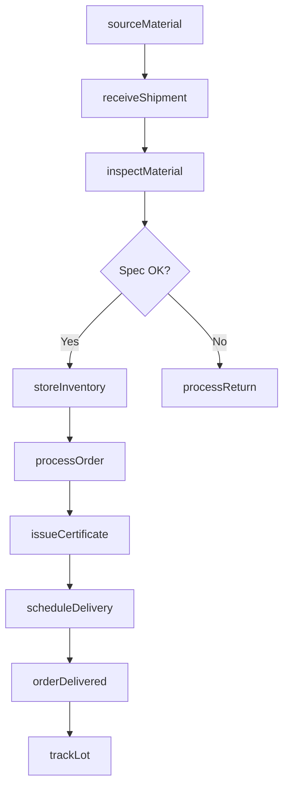
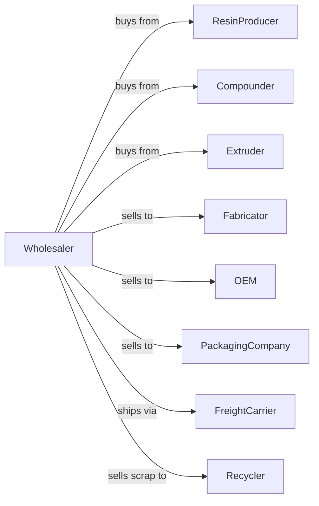

# Plastics Materials and Basic Forms and Shapes Merchant Wholesalers

> Business-as-Code definition for plastics wholesale distribution operations. Models the complete supply chain for resins, films, sheets, rods, and other plastic materials.

## Overview

Plastics materials merchant wholesalers distribute resins, compounds, films, sheets, rods, tubes, and other basic plastic forms to manufacturers, fabricators, and industrial users. This definition exposes actions for materials procurement, inventory management, technical support, and order fulfillment with events for automated replenishment and market pricing.

## Actors

| Actor | Description |
|-------|-------------|
| ResinProducer | Petrochemical company manufacturing plastic resins |
| Compounder | Produces custom plastic compounds and blends |
| Extruder | Manufacturer of film, sheet, and profile shapes |
| Fabricator | Plastics processor purchasing materials for production |
| OEM | Original equipment manufacturer using plastic components |
| PackagingCompany | Buyer of films and sheets for packaging applications |
| FreightCarrier | Trucking company transporting bulk and packaged materials |
| Recycler | Processor of post-industrial and post-consumer plastics |

## Roles

| Role | Description |
|------|-------------|
| ProductManager | Manages material lines and supplier relationships |
| TechnicalSpecialist | Provides application engineering and material selection |
| SalesRepresentative | Manages customer accounts and negotiates pricing |
| WarehouseManager | Oversees inventory and distribution operations |
| PurchasingAgent | Procures materials from producers and compounders |
| CustomerServiceRep | Handles orders, inquiries, and issue resolution |

## Entities

| Entity | Description |
|--------|-------------|
| Resin | Base polymer material with grade and specifications |
| Compound | Formulated material with additives and properties |
| Form | Sheet, film, rod, tube, or profile shape |
| Inventory | Current stock by material, grade, and form |
| PurchaseOrder | Customer order specifying materials and quantities |
| Specification | Technical data sheet with material properties |
| PriceList | Current pricing by material, grade, and volume |
| LotNumber | Batch identifier for traceability |
| SafetyDataSheet | SDS document for handling and storage |
| Certificate | COA or COC documenting material compliance |

## Actions

| Action | Description |
|--------|-------------|
| sourceMaterial | Procure resins, compounds, or forms from suppliers |
| receiveShipment | Accept delivery and verify against purchase order |
| inspectMaterial | Check for quality and specification compliance |
| storeInventory | Place materials in appropriate warehouse location |
| processOrder | Pick, pack, and prepare customer order |
| priceMaterial | Set pricing based on market and volume |
| scheduleDelivery | Arrange transport to customer location |
| provideTechSupport | Assist with material selection and application |
| issueCertificate | Provide compliance documentation |
| processReturn | Handle off-spec or damaged material returns |
| trackLot | Maintain traceability from producer to customer |
| forecastDemand | Predict material needs based on customer patterns |

## Events

| Event | Description |
|-------|-------------|
| shipmentReceived | Material arrived from supplier |
| materialInspected | Quality verification completed |
| materialStored | Product placed in warehouse |
| orderReceived | Customer purchase order submitted |
| orderShipped | Delivery departed for customer |
| orderDelivered | Customer confirmed receipt |
| inventoryDepleted | Stock fell below reorder level |
| priceChanged | Supplier or market pricing updated |
| specificationUpdated | Material technical data revised |
| qualityIssueDetected | Material failed inspection or customer complaint |
| lotRecalled | Supplier issued material recall |
| demandForecast | Projected needs calculated |

## Searches

| Search | Description |
|--------|-------------|
| findMaterials | Search catalog by polymer type, grade, or properties |
| getInventory | Check stock levels by material and location |
| getOrders | Retrieve orders by customer, status, or date |
| trackShipment | Get delivery status and ETA |
| findSuppliers | Search suppliers by material or capability |
| getSpecifications | Retrieve technical data sheets |
| getLotHistory | Trace material from producer through customer |

## Workflow



## Actor Relationships



## Usage

### Calling Actions

```typescript
import { wholesalePlastics } from '@headlessly/wholesale-plastics'

const distributor = wholesalePlastics()

// Search catalog by polymer type, grade, or properties
const findMaterialsResult = await distributor.findMaterials({ status: 'active' })

// Check stock levels by material and location
const getInventoryResult = await distributor.getInventory({ status: 'available', category: 'main' })

// Source resin from producer
const shipment = await distributor.sourceMaterial({
  supplierId: 'dow-chemical',
  material: 'HDPE',
  grade: 'DMDA-8907',
  quantity: 44000,
  unit: 'lb',
  packaging: 'gaylord'
})

// Process customer order
await distributor.processOrder({
  customerId: 'acme-molding',
  items: [
    { materialId: 'hdpe-8907', quantity: 2200, unit: 'lb' },
    { materialId: 'pp-copolymer', quantity: 1100, unit: 'lb' }
  ],
  deliveryDate: '2024-02-12'
})

// Issue compliance certificate
await distributor.issueCertificate({
  orderId: 'order-456',
  documentType: 'COA',
  lotNumbers: ['LOT-2024-001', 'LOT-2024-002']
})
```

### Event-Driven Automation

```typescript
// Auto-reorder when inventory low
distributor.inventoryDepleted(async ({ materialId, currentStock, reorderPoint }) => {
  const supplier = await distributor.findSuppliers({ material: materialId })
  await distributor.sourceMaterial({
    supplierId: supplier[0].id,
    material: materialId,
    quantity: reorderPoint * 2
  })
})

// Auto-notify on price changes
distributor.priceChanged(async ({ materialId, oldPrice, newPrice }) => {
  const percentChange = ((newPrice - oldPrice) / oldPrice) * 100
  if (Math.abs(percentChange) > 5) {
    await notifyCustomers({
      material: materialId,
      message: `Price ${percentChange > 0 ? 'increased' : 'decreased'} ${Math.abs(percentChange).toFixed(1)}%`
    })
  }
})
```
