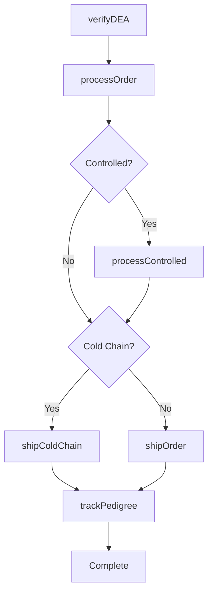
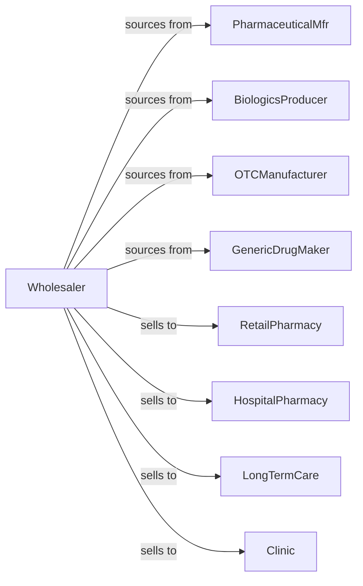

# Drugs and Druggists' Sundries Merchant Wholesalers

> Business-as-Code definition for pharmaceutical wholesale distribution. Models drug procurement, regulatory compliance, and cold chain logistics for prescription medications, biologics, and healthcare products.

## Overview

Pharmaceutical wholesalers distribute prescription drugs, biologics, OTC medications, vaccines, and medical sundries to pharmacies, hospitals, and healthcare facilities. This definition exposes actions for drug sourcing, regulatory compliance, and temperature-controlled fulfillment with events for pedigree tracking and controlled substance management.

## Actors

| Actor | Description |
|-------|-------------|
| PharmaceuticalMfr | Manufactures prescription drugs |
| BiologicsProducer | Creates vaccines and biologics |
| OTCManufacturer | Produces over-the-counter medications |
| GenericDrugMaker | Manufactures generic pharmaceuticals |
| RetailPharmacy | Dispenses medications to patients |
| HospitalPharmacy | Serves inpatient medication needs |
| LongTermCare | Skilled nursing and assisted living |
| Clinic | Outpatient healthcare facility |

## Roles

| Role | Description |
|------|-------------|
| PharmacyAccountMgr | Serves pharmacy customers |
| RegulatoryCompliance | Manages DEA and FDA requirements |
| ColdChainSpecialist | Oversees temperature-controlled products |
| PedigreeCoordinator | Tracks drug serialization |
| ControlledSubstanceMgr | Manages Schedule II-V drugs |
| LicensedPharmacist | Verifies prescription orders and oversees drug handling compliance |

## Entities

| Entity | Description |
|--------|-------------|
| Drug | Pharmaceutical product with NDC |
| Inventory | Stock levels with lot and expiry |
| PurchaseOrder | Order placed with manufacturer |
| SalesOrder | Customer order for drugs |
| Pedigree | Drug supply chain documentation |
| ColdChain | Temperature-controlled shipment |
| ControlledSubstance | DEA scheduled medication |
| DEALicense | Customer DEA registration |
| Recall | Product recall notification |
| Return | Customer return authorization |
| Chargeback | Manufacturer contract adjustment |

## Actions

| Action | Description |
|--------|-------------|
| sourceDrug | Contract with pharmaceutical manufacturers |
| placeOrder | Submit purchase order to manufacturer |
| receiveInventory | Check in with lot tracking |
| stockWarehouse | Store in appropriate conditions |
| verifyDEA | Validate customer DEA license |
| processOrder | Fulfill pharmacy order |
| shipColdChain | Dispatch temperature-controlled products |
| trackPedigree | Maintain serialization records |
| processControlled | Handle Schedule II-V orders |
| processRecall | Execute product recall |
| processReturn | Handle expired or damaged returns |
| submitChargeback | Request manufacturer adjustment |
| reportDEA | File regulatory reports |
| trackExpiry | Monitor product expiration dates |

## Events

| Event | Description |
|-------|-------------|
| orderReceived | Customer placed order |
| inventoryReceived | Manufacturer shipment arrived |
| orderShipped | Products dispatched |
| orderDelivered | Customer received products |
| deaVerified | License validated |
| controlledProcessed | Scheduled drug order completed |
| pedigreeRecorded | Serialization documented |
| coldChainMaintained | Temperature verified |
| recallAnnounced | Product recall issued |
| expiryNeared | Products near expiration |
| chargebackSubmitted | Adjustment requested |
| deaReportFiled | Regulatory filing completed |

## Searches

| Search | Description |
|--------|-------------|
| findDrugs | Search by NDC, name, manufacturer |
| getInventory | Check stock with lot and expiry |
| getOrders | Retrieve orders by status |
| getCustomers | List pharmacy accounts |
| getPedigree | Access serialization records |
| getRecalls | View active recalls |
| getControlled | Track scheduled drug orders |

## Workflow



## Actor Relationships



## Usage

### Calling Actions

```typescript
import { distributePharmaceuticals } from '@headlessly/distribute-pharmaceuticals'

const distributor = distributePharmaceuticals()

// Search drug inventory
const medications = await distributor.findDrugs({
  ndc: '12345-678-90',
  manufacturer: 'pfizer',
  form: 'tablet',
  strength: '10mg'
})

// Verify DEA and process order
await distributor.verifyDEA({
  customerId: 'pharmacy-456',
  deaNumber: 'AB1234567',
  schedules: ['II', 'III', 'IV', 'V']
})

const order = await distributor.processOrder({
  customerId: 'pharmacy-456',
  items: [
    { ndc: '12345-678-90', quantity: 100 },
    { ndc: '98765-432-10', quantity: 50, controlled: 'schedule-iv' }
  ],
  shipMethod: 'next-day'
})

// Ship cold chain products
await distributor.shipColdChain({
  orderId: order.id,
  items: order.coldChainItems,
  temperature: { min: 2, max: 8, unit: 'celsius' },
  monitoring: 'datalogger'
})
```

### Event-Driven Automation

```typescript
// Process recalls immediately
distributor.recallAnnounced(async ({ ndc, lotNumbers, reason }) => {
  const affectedCustomers = await getCustomersWithProduct(ndc, lotNumbers)

  for (const customer of affectedCustomers) {
    await notifyCustomer({
      customerId: customer.id,
      urgency: 'high',
      message: `RECALL: ${ndc} lots ${lotNumbers.join(', ')}`
    })
  }

  await distributor.processRecall({
    ndc,
    lotNumbers,
    action: 'quarantine'
  })
})

// Track expiring inventory
distributor.expiryNeared(async ({ ndc, lotNumber, daysRemaining }) => {
  if (daysRemaining < 90) {
    await createShortDatePromotion({
      ndc,
      lotNumber,
      discount: calculateDiscount(daysRemaining)
    })
  }
})
```
