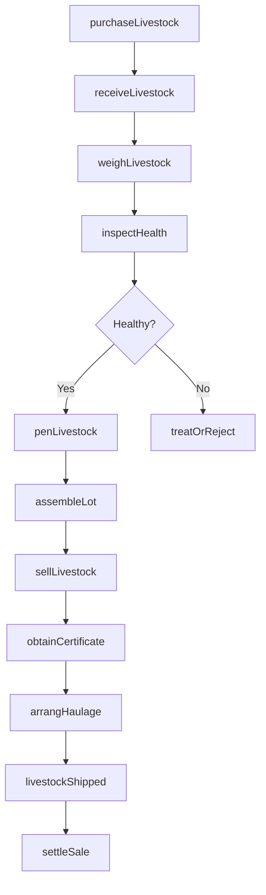
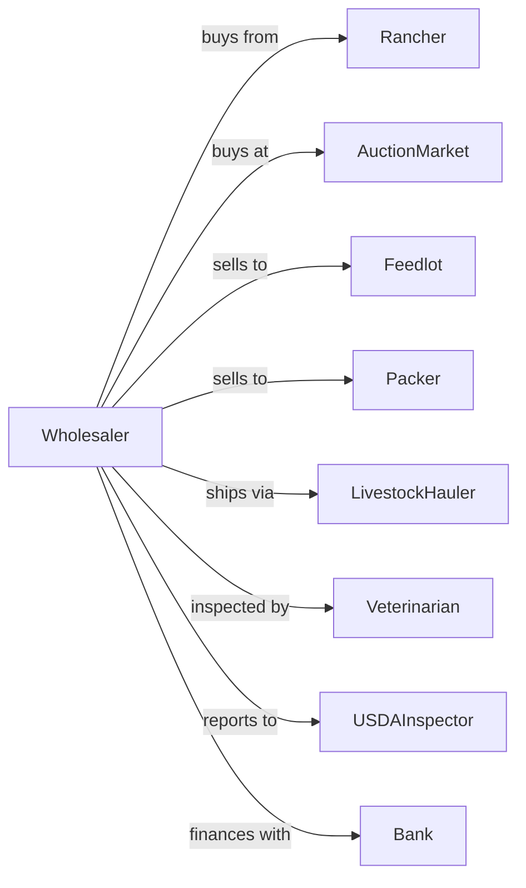

# Livestock Merchant Wholesalers

> Business-as-Code definition for livestock wholesale operations. Models the complete buying, assembling, and selling cycle for cattle, hogs, sheep, and other livestock.

## Overview

Livestock merchant wholesalers buy cattle, hogs, sheep, goats, and other animals from producers, assemble market-ready lots, and sell to packers, feedlots, and other buyers. This definition exposes actions for livestock procurement, health inspection, lot assembly, and auction or direct sale with events for automated market timing and regulatory compliance.

## Actors

| Actor | Description |
|-------|-------------|
| Rancher | Cattle or livestock producer selling animals |
| Feedlot | Buyer finishing cattle for slaughter |
| Packer | Slaughter facility purchasing market-ready animals |
| AuctionMarket | Livestock auction house facilitating sales |
| LivestockHauler | Trucking company transporting animals |
| Veterinarian | Provides health inspections and certifications |
| USDAInspector | Federal inspector ensuring animal health compliance |
| Bank | Provides livestock financing and operating credit |

## Roles

| Role | Description |
|------|-------------|
| LivestockBuyer | Procures animals from ranchers and auctions |
| YardManager | Oversees receiving, holding, and shipping operations |
| AnimalHealthTech | Monitors animal condition and administers treatments |
| OrderBuyer | Purchases specific lots to fill customer orders |
| SalesRepresentative | Negotiates sales to packers and feedlots |
| Bookkeeper | Tracks purchases, sales, and commissions |
| Auctioneer | Calls bids and conducts live livestock auction sales |
| BrandInspector | Verifies livestock ownership through brand identification |

## Entities

| Entity | Description |
|--------|-------------|
| AnimalLot | Group of animals with origin, count, and specifications |
| Animal | Individual head with weight, breed, and health status |
| PurchaseTicket | Record of livestock purchase with price and terms |
| SaleTicket | Record of livestock sale with price and buyer |
| HealthCertificate | Veterinary documentation for interstate movement |
| BrandInspection | Ownership verification document |
| Pen | Holding area for assembled livestock lots |
| WeightTicket | Scale record for incoming or outgoing animals |
| Commission | Fee structure for buying or selling services |
| MarketReport | Current prices by weight, grade, and location |

## Actions

| Action | Description |
|--------|-------------|
| purchaseLivestock | Buy animals from producer or auction |
| receiveLivestock | Accept delivery and verify count and condition |
| inspectHealth | Conduct veterinary examination and testing |
| penLivestock | Place animals in appropriate holding area |
| assembleLot | Group animals by weight, grade, or buyer specs |
| feedAndWater | Provide care during holding period |
| sellLivestock | Execute sale to packer, feedlot, or buyer |
| arrangHaulage | Schedule trucking for livestock movement |
| obtainCertificate | Secure health papers for interstate transport |
| weighLivestock | Record weights for pricing and settlement |
| settleSale | Complete payment to seller |
| reportSales | Submit market data to USDA |

## Events

| Event | Description |
|-------|-------------|
| livestockReceived | Animals arrived at facility |
| healthInspected | Veterinary examination completed |
| livestockPenned | Animals placed in holding pen |
| lotAssembled | Animals grouped for sale |
| livestockSold | Sale transaction completed |
| livestockShipped | Animals departed for buyer |
| paymentSettled | Producer payment issued |
| healthIssueDetected | Animal health issue detected in livestock |
| priceThresholdBreached | Market price crossed monitored threshold |
| certificateExpirationNeared | Health certificate approaching expiration |
| capacityBecameFull | Pen or yard capacity reached |
| weightRecorded | Scale ticket generated |

## Searches

| Search | Description |
|--------|-------------|
| getInventory | Check current livestock holdings by type and pen |
| getPurchases | Retrieve recent purchases by seller or date |
| getSales | View completed sales by buyer or date |
| findProducers | Search rancher accounts and delivery history |
| getMarketPrices | Get current livestock prices by class |
| trackShipment | Follow livestock in transit |
| getHealthRecords | View health certificates and inspections |

## Workflow



## Actor Relationships



## Usage

### Calling Actions

```typescript
import { wholesaleLivestock } from '@headlessly/wholesale-livestock'

const market = wholesaleLivestock()

// Check current livestock holdings by type and pen
const getInventoryResult = await market.getInventory({ status: 'available', category: 'main' })

// Retrieve recent purchases by seller or date
const getPurchasesResult = await market.getPurchases({ status: 'active' })

// Purchase cattle from rancher
const lot = await market.purchaseLivestock({
  sellerId: 'smith-ranch',
  species: 'cattle',
  class: 'feeder-steers',
  headCount: 50,
  avgWeight: 750,
  pricePerCwt: 185.00
})

// Receive and inspect
await market.receiveLivestock({
  lotId: lot.id,
  arrivalDate: '2024-02-10',
  truckId: 'carrier-456'
})

await market.inspectHealth({
  lotId: lot.id,
  tests: ['visualExam', 'temperature'],
  veterinarianId: 'dr-wilson'
})

// Sell to feedlot
await market.sellLivestock({
  lotId: lot.id,
  buyerId: 'midwest-feeders',
  pricePerCwt: 188.50,
  deliveryDate: '2024-02-12'
})
```

### Event-Driven Automation

```typescript
// Auto-alert on market price movement
market.priceThresholdBreached(async ({ species, class: animalClass, price, threshold }) => {
  if (price > threshold) {
    const inventory = await market.getInventory({ species, class: animalClass })
    await notifySales({
      message: `Market up - ${inventory.headCount} head ready to sell`
    })
  }
})

// Auto-arrange hauling on sale
market.livestockSold(async ({ lotId, buyerId, deliveryDate }) => {
  await market.obtainCertificate({ lotId })
  await market.arrangHaulage({
    lotId,
    destination: buyerId,
    pickupDate: deliveryDate
  })
})
```
