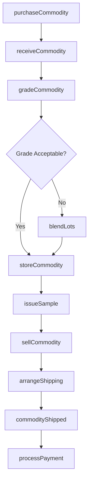
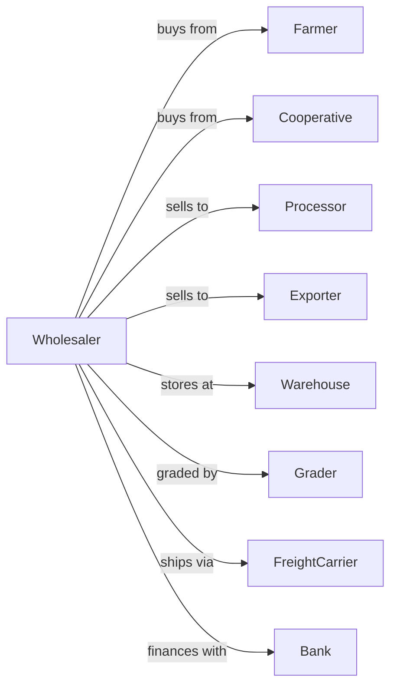

# Other Farm Product Raw Material Merchant Wholesalers

> Business-as-Code definition for specialty agricultural commodity wholesale operations. Models the complete procurement, processing, and distribution cycle for cotton, tobacco, hides, wool, and other farm raw materials.

## Overview

Other farm product merchant wholesalers distribute raw agricultural commodities including cotton, tobacco, hides, wool, nuts, and specialty fibers to processors and manufacturers. This definition exposes actions for commodity procurement, grading, warehousing, and sale with events for automated inventory management and market timing.

## Actors

| Actor | Description |
|-------|-------------|
| Farmer | Producer selling cotton, tobacco, or other commodities |
| Cooperative | Farmer-owned organization aggregating member production |
| Processor | Mill, tannery, or manufacturer purchasing raw materials |
| Exporter | Trading company shipping commodities internationally |
| Warehouse | Licensed storage facility for commodities |
| Grader | USDA or industry inspector certifying quality |
| FreightCarrier | Trucking or rail company transporting commodities |
| Bank | Provides commodity financing and warehouse receipts |

## Roles

| Role | Description |
|------|-------------|
| CommodityBuyer | Procures raw materials from farmers and cooperatives |
| QualityGrader | Evaluates and grades incoming product |
| WarehouseManager | Oversees storage operations and inventory |
| SalesRepresentative | Negotiates sales to processors and exporters |
| LogisticsCoordinator | Arranges transportation and documentation |
| AccountManager | Tracks purchases, sales, and settlements |

## Entities

| Entity | Description |
|--------|-------------|
| CommodityLot | Batch of product with origin, grade, and weight |
| GradeCertificate | Official quality classification document |
| WarehouseReceipt | Negotiable document for stored commodity |
| Contract | Purchase or sale agreement with terms |
| Inventory | Current stocks by commodity, grade, and location |
| PriceQuote | Current market price for commodity grade |
| ShippingDocument | Bill of lading and export documentation |
| SupplierAccount | Farmer or cooperative profile with history |
| PaymentSettlement | Record of completed transaction payment |
| SampleRecord | Lab or visual inspection results |

## Actions

| Action | Description |
|--------|-------------|
| purchaseCommodity | Buy raw material from farmer or cooperative |
| receiveCommodity | Accept delivery and verify weight and condition |
| gradeCommodity | Evaluate quality and assign official grade |
| storeCommodity | Place in appropriate warehouse location |
| sellCommodity | Execute sale to processor or exporter |
| arrangeShipping | Schedule transport to buyer destination |
| issueSample | Provide product samples for buyer evaluation |
| processPayment | Complete settlement with seller |
| transferReceipt | Assign warehouse receipt to new owner |
| hedgePosition | Manage price risk through futures or options |
| exportCommodity | Handle international shipping and documentation |
| blendLots | Combine lots to meet buyer specifications |

## Events

| Event | Description |
|-------|-------------|
| commodityReceived | Raw material arrived at facility |
| commodityGraded | Quality classification completed |
| commodityStored | Product placed in warehouse |
| commoditySold | Sale transaction executed |
| commodityShipped | Outbound shipment departed |
| paymentSettled | Transaction payment completed |
| priceThresholdBreached | Market price crossed monitored threshold |
| inventoryDepleted | Stock fell below reorder level |
| receiptTransferred | Warehouse receipt assigned to buyer |
| gradeDisputeRaised | Quality classification challenged |
| exportCleared | International shipment cleared customs |
| sampleApproved | Buyer accepted product sample |

## Searches

| Search | Description |
|--------|-------------|
| getInventory | Check stocks by commodity, grade, and location |
| getContracts | Retrieve open purchase and sale agreements |
| findSuppliers | Search farmer and cooperative accounts |
| getMarketPrices | Get current prices by commodity and grade |
| getWarehouseReceipts | List outstanding warehouse receipts |
| trackShipments | Monitor outbound commodity movements |
| getGradeHistory | View grading results for a supplier |

## Workflow



## Actor Relationships



## Usage

### Calling Actions

```typescript
import { wholesaleFarmProducts } from '@headlessly/wholesale-farm-products'

const merchant = wholesaleFarmProducts()

// Check stocks by commodity, grade, and location
const getInventoryResult = await merchant.getInventory({ status: 'available', category: 'main' })

// Retrieve open purchase and sale agreements
const getContractsResult = await merchant.getContracts({ status: 'active', department: 'public-works' })

// Purchase cotton from cooperative
const lot = await merchant.purchaseCommodity({
  supplierId: 'delta-cotton-coop',
  commodity: 'cotton',
  bales: 200,
  estimatedGrade: 'middling',
  deliveryDate: '2024-02-15'
})

// Receive and grade
await merchant.receiveCommodity({
  lotId: lot.id,
  actualBales: 200,
  grossWeight: 100000
})

const grade = await merchant.gradeCommodity({
  lotId: lot.id,
  metrics: ['stapleLength', 'micronaire', 'strength', 'color']
})

// Sell to textile mill
await merchant.sellCommodity({
  lotId: lot.id,
  buyerId: 'southern-textiles',
  pricePerBale: 850.00,
  deliveryTerms: 'FOB-warehouse'
})
```

### Event-Driven Automation

```typescript
// Auto-hedge on purchase
merchant.commodityReceived(async ({ lotId, commodity, quantity }) => {
  await merchant.hedgePosition({
    commodity,
    quantity,
    action: 'sell',
    month: getNearbyFuturesMonth(commodity)
  })
})

// Auto-alert on price opportunity
merchant.priceThresholdBreached(async ({ commodity, grade, price, direction }) => {
  if (direction === 'up') {
    const inventory = await merchant.getInventory({ commodity, grade })
    await notifySales({
      message: `${commodity} ${grade} up to ${price} - ${inventory.quantity} in stock`
    })
  }
})
```
