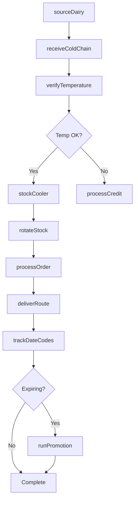
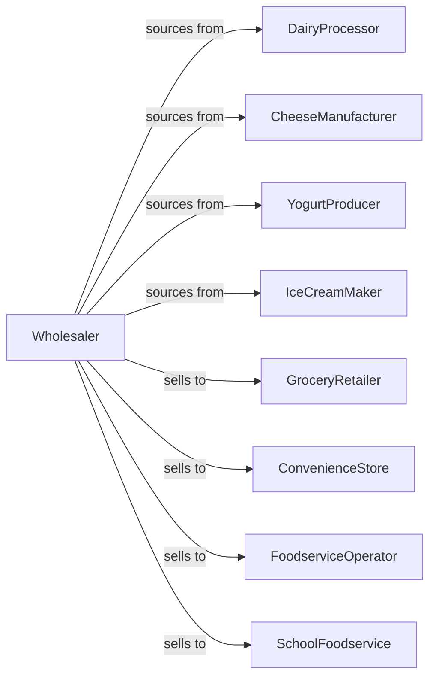

# Dairy Product (except Dried or Canned) Merchant Wholesalers

> Business-as-Code definition for fresh dairy wholesale distribution. Models cold chain logistics, short-dated inventory management, and retail fulfillment for milk, cheese, and cultured dairy products.

## Overview

Dairy product wholesalers distribute fluid milk, cheese, butter, yogurt, cream, and ice cream to grocers, foodservice operators, and convenience stores. This definition exposes actions for cold chain sourcing, date code management, and route delivery with events for freshness tracking and temperature compliance.

## Actors

| Actor | Description |
|-------|-------------|
| DairyProcessor | Produces fluid milk and cream |
| CheeseManufacturer | Makes cheese and cultured products |
| YogurtProducer | Creates yogurt and cultured dairy |
| IceCreamMaker | Manufactures ice cream and frozen dairy |
| GroceryRetailer | Sells dairy to consumers |
| ConvenienceStore | C-store with dairy cooler |
| FoodserviceOperator | Restaurant using dairy products |
| SchoolFoodservice | K-12 milk and dairy program |

## Roles

| Role | Description |
|------|-------------|
| DairyBuyer | Sources products from processors |
| SalesRepresentative | Serves retail and foodservice accounts |
| RouteDriver | Delivers in refrigerated trucks |
| DateCodeSpecialist | Manages freshness rotation |
| ColdChainCoordinator | Oversees temperature compliance |
| SchoolMilkCoordinator | Manages USDA school milk program orders, deliveries, and reimbursement claims |

## Entities

| Entity | Description |
|--------|-------------|
| Product | Dairy item with specs |
| Inventory | Stock levels with date codes |
| PurchaseOrder | Order placed with processor |
| SalesOrder | Customer order |
| Route | Refrigerated delivery route |
| DateCode | Product freshness date |
| ColdChain | Temperature-controlled supply chain |
| TemperatureLog | Temperature monitoring record |
| SchoolProgram | K-12 dairy program |
| Promotion | Manufacturer deal |
| Return | Customer return or credit |

## Actions

| Action | Description |
|--------|-------------|
| sourceDairy | Contract with dairy processors |
| placeOrder | Submit purchase order |
| receiveColdChain | Check in with temperature verification |
| stockCooler | Store in refrigerated warehouse |
| quoteProducts | Price products for customer |
| processOrder | Fulfill customer order |
| deliverRoute | Execute refrigerated delivery |
| verifyTemperature | Check cold chain integrity |
| rotateStock | Ensure FIFO date rotation |
| processSchoolOrder | Handle school milk program |
| trackDateCodes | Monitor freshness dates |
| processCredit | Handle returns and spoilage |
| runPromotion | Execute manufacturer deal |
| forecastDemand | Project daily requirements |

## Events

| Event | Description |
|-------|-------------|
| orderReceived | Customer placed order |
| inventoryReceived | Processor shipment arrived |
| temperatureVerified | Cold chain confirmed |
| orderDelivered | Products delivered |
| routeCompleted | Deliveries finished |
| dateCodeExpirationNeared | Products approaching freshness date |
| temperatureExcursionDetected | Cold chain breach detected |
| creditIssued | Spoilage credit processed |
| promotionStarted | Manufacturer deal began |
| stockDepleted | Inventory fell below reorder level |
| schoolOrderReceived | School program order placed |
| returnProcessed | Return completed |

## Searches

| Search | Description |
|--------|-------------|
| findProducts | Search by type, brand, size |
| getInventory | Check stock with date codes |
| getOrders | Retrieve orders by status |
| getRoutes | View delivery schedules |
| getDateCodes | Track products by freshness |
| getTemperatureLogs | Access compliance records |
| getSchoolOrders | View school program orders |

## Workflow



## Actor Relationships



## Usage

### Calling Actions

```typescript
import { distributeDairyProduct } from '@headlessly/distribute-dairy-product'

const distributor = distributeDairyProduct()

// Search dairy products
const milk = await distributor.findProducts({
  type: 'fluid-milk',
  fatContent: '2%',
  size: 'gallon',
  organic: false
})

// Process order with date code requirements
const order = await distributor.processOrder({
  customerId: 'grocer-456',
  items: [
    { productId: milk[0].id, cases: 20, minDaysRemaining: 10 }
  ],
  delivery: {
    date: '2024-04-15',
    temperatureRange: { min: 33, max: 40, unit: 'fahrenheit' }
  }
})

// Process school milk order
await distributor.processSchoolOrder({
  schoolDistrictId: 'district-789',
  products: [
    { type: 'half-pint-1%', quantity: 5000 },
    { type: 'half-pint-chocolate', quantity: 3000 }
  ],
  deliverySchedule: 'daily-am'
})
```

### Event-Driven Automation

```typescript
// Promote items near date code
distributor.dateCodeExpirationNeared(async ({ productId, dateCode, daysRemaining }) => {
  if (daysRemaining < 5) {
    await distributor.runPromotion({
      productId,
      dateCode,
      discount: 50,
      channels: ['foodservice']
    })
  }
})

// Alert on cold chain issues
distributor.temperatureExcursionDetected(async ({ loadId, temperature, duration }) => {
  if (duration > 30) {
    await createAlert({
      severity: 'critical',
      message: `Cold chain breach: ${temperature}F for ${duration} minutes`
    })

    await quarantineLoad({ loadId })
  }
})
```
