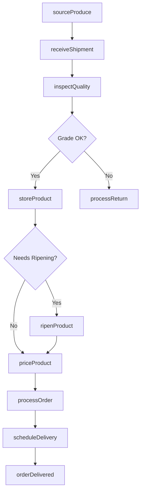
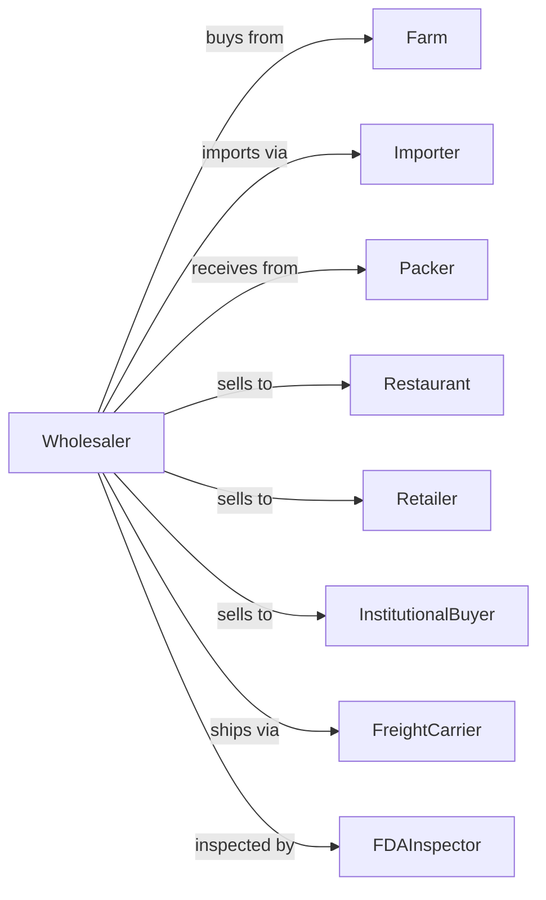

# Fresh Fruit and Vegetable Merchant Wholesalers

> Business-as-Code definition for fresh produce wholesale distribution operations. Models the complete cold chain from farms and importers through restaurant and retail delivery.

## Overview

Fresh fruit and vegetable merchant wholesalers distribute produce from domestic farms and international sources to restaurants, grocery retailers, and foodservice operators. This definition exposes actions for produce procurement, ripeness management, cold chain optimization, and order fulfillment with events for automated inventory rotation and seasonal availability tracking.

## Actors

| Actor | Description |
|-------|-------------|
| Farm | Domestic agricultural producer supplying fresh produce |
| Importer | Brings produce from international growing regions |
| Packer | Facility that washes, grades, and packages produce |
| Restaurant | Foodservice buyer purchasing produce for menu items |
| Retailer | Grocery store or produce market purchasing for resale |
| InstitutionalBuyer | Hospital, school, or cafeteria purchasing in volume |
| FreightCarrier | Refrigerated transport provider |
| FDAInspector | Federal inspector ensuring food safety compliance |

## Roles

| Role | Description |
|------|-------------|
| BuyingManager | Sources produce and manages supplier relationships |
| QualityInspector | Grades incoming product and monitors ripeness |
| WarehouseManager | Oversees cold storage and ripening room operations |
| SalesRepresentative | Manages customer accounts and takes orders |
| DeliveryDriver | Operates refrigerated trucks for local delivery |
| InventoryPlanner | Forecasts demand based on seasonality and trends |

## Entities

| Entity | Description |
|--------|-------------|
| ProduceLot | Batch of produce with origin, harvest date, and grade |
| Product | Specific variety, size, and pack configuration |
| Inventory | Current stock levels by product and storage location |
| PurchaseOrder | Customer order specifying products and quantities |
| ColdStorage | Temperature-controlled warehouse space |
| RipeningRoom | Controlled environment for ripening climacteric fruits |
| QualityGrade | US Grade (Fancy, No. 1, No. 2) based on inspection |
| SupplierContract | Seasonal agreement with farm or importer |
| ShipmentManifest | Documentation for incoming or outgoing loads |
| PriceList | Current wholesale prices by product and market |

## Actions

| Action | Description |
|--------|-------------|
| sourceProduce | Procure fruits and vegetables from farms or importers |
| receiveShipment | Accept delivery and verify against manifest |
| inspectQuality | Grade product for freshness, size, and defects |
| storeProduct | Place in appropriate cold storage or ripening room |
| ripenProduct | Manage controlled ripening for climacteric fruits |
| processOrder | Pick, pack, and prepare customer order |
| priceProduct | Set wholesale prices based on market conditions |
| scheduleDelivery | Arrange refrigerated transport to customer |
| rotateInventory | Move older stock forward using FIFO |
| processReturn | Handle rejected or returned product |
| forecastDemand | Predict upcoming needs based on seasonality |
| repackProduct | Repackage bulk produce into customer-specified units |

## Events

| Event | Description |
|-------|-------------|
| produceReceived | Produce lot arrived from supplier |
| shipmentInspected | Quality grading completed on incoming product |
| productStored | Produce placed in cold storage |
| ripeningComplete | Fruit reached optimal ripeness |
| orderReceived | Customer purchase order submitted |
| orderPicked | Products selected and staged for delivery |
| orderShipped | Delivery departed for customer |
| orderDelivered | Customer confirmed receipt |
| inventoryLow | Stock fell below reorder threshold |
| lotExpiring | Product approaching freshness limit |
| priceUpdated | Wholesale pricing changed |
| seasonStarted | New growing season began for a commodity |

## Searches

| Search | Description |
|--------|-------------|
| findProducts | Search catalog by commodity, variety, or origin |
| getInventory | Check stock levels by product and location |
| getOrders | Retrieve orders by customer, status, or date |
| trackShipment | Get delivery status and ETA |
| findSuppliers | Search suppliers by commodity or region |
| getSeasonalCalendar | View availability windows by commodity |
| getExpiringStock | List products by remaining shelf life |

## Workflow



## Actor Relationships



## Usage

### Calling Actions

```typescript
import { distributeProduce } from '@headlessly/distribute-produce'

const wholesaler = distributeProduce()

// Search catalog by commodity, variety, or origin
const findProductsResult = await wholesaler.findProducts({ category: 'featured', inStock: true })

// Check stock levels by product and location
const getInventoryResult = await wholesaler.getInventory({ status: 'available', category: 'main' })

// Source produce from farm
const lot = await wholesaler.sourceProduce({
  supplierId: 'california-farms',
  commodity: 'strawberries',
  variety: 'driscoll',
  quantity: 500,
  unit: 'flat',
  harvestDate: '2024-02-10'
})

// Inspect and grade
const inspection = await wholesaler.inspectQuality({
  lotId: lot.id,
  metrics: ['color', 'firmness', 'size', 'defects'],
  inspector: 'inspector-garcia'
})

// Process customer order
await wholesaler.processOrder({
  customerId: 'grocery-chain-west',
  items: [
    { productId: 'strawberries-1lb', quantity: 200, unit: 'clamshell' },
    { productId: 'blueberries-pint', quantity: 150, unit: 'pint' }
  ],
  deliveryDate: '2024-02-12',
  deliveryWindow: 'morning'
})
```

### Event-Driven Automation

```typescript
// Auto-discount expiring produce
wholesaler.lotExpiring(async ({ lotId, daysRemaining, product }) => {
  if (daysRemaining <= 2) {
    await wholesaler.priceProduct({
      productId: product.id,
      discount: 0.30,
      reason: 'quick-sale'
    })
  }
})

// Auto-reorder when inventory low
wholesaler.inventoryLow(async ({ productId, currentStock }) => {
  const calendar = await wholesaler.getSeasonalCalendar({ commodity: productId })
  if (calendar.inSeason) {
    const suppliers = await wholesaler.findSuppliers({ commodity: productId })
    await wholesaler.sourceProduce({
      supplierId: suppliers[0].id,
      commodity: productId,
      quantity: currentStock * 3
    })
  }
})
```
