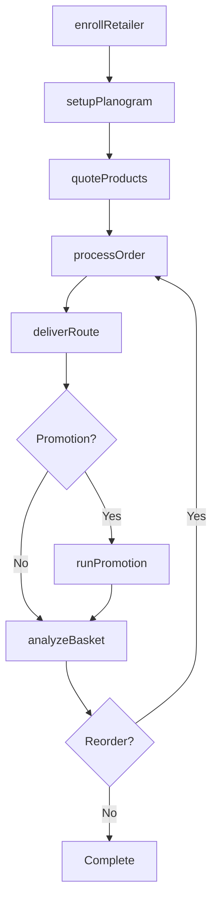
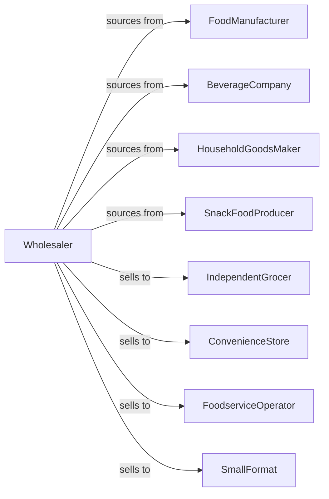

# General Line Grocery Merchant Wholesalers

> Business-as-Code definition for full-line grocery wholesale distribution. Models procurement, retailer programs, and multi-category fulfillment for independent grocers and convenience stores.

## Overview

General line grocery wholesalers distribute a wide range of grocery products including canned goods, dry goods, beverages, snacks, and household items to independent grocers, convenience stores, and foodservice operators. This definition exposes actions for product sourcing, retailer support programs, and route delivery with events for promotions and category management.

## Actors

| Actor | Description |
|-------|-------------|
| FoodManufacturer | Produces packaged food products |
| BeverageCompany | Manufactures drinks and beverages |
| HouseholdGoodsMaker | Produces cleaning and paper products |
| SnackFoodProducer | Makes chips, crackers, and snacks |
| IndependentGrocer | Locally-owned grocery store |
| ConvenienceStore | C-store or gas station mart |
| FoodserviceOperator | Restaurant or institutional kitchen |
| SmallFormat | Dollar store or small retailer |

## Roles

| Role | Description |
|------|-------------|
| CategoryManager | Manages product categories |
| SalesRepresentative | Serves grocery accounts |
| RouteDriver | Delivers products on schedule |
| RetailConsultant | Supports store merchandising |
| PromotionsCoordinator | Manages manufacturer deals |

## Entities

| Entity | Description |
|--------|-------------|
| Product | Grocery item with UPC |
| Inventory | Stock levels by location |
| PurchaseOrder | Order placed with manufacturer |
| SalesOrder | Customer order |
| Route | Scheduled delivery route |
| Promotion | Manufacturer deal or ad |
| Planogram | Store shelf configuration |
| RetailerProgram | Independent grocer support |
| PriceList | Customer pricing document |
| Credit | Customer account balance |
| Return | Customer return authorization |

## Actions

| Action | Description |
|--------|-------------|
| sourceProduct | Identify and onboard product lines |
| placeOrder | Submit purchase order to manufacturer |
| receiveInventory | Check in incoming products |
| stockWarehouse | Store products in locations |
| enrollRetailer | Add retailer to program |
| quoteProducts | Price products for customer |
| processOrder | Fulfill customer order |
| deliverRoute | Execute scheduled delivery |
| setupPlanogram | Configure store shelves |
| runPromotion | Execute manufacturer deal |
| processReturn | Handle customer returns |
| manageCategory | Optimize product assortment |
| extendCredit | Manage customer credit |
| analyzeBasket | Study purchase patterns |

## Events

| Event | Description |
|-------|-------------|
| orderReceived | Customer placed order |
| inventoryReceived | Manufacturer shipment arrived |
| orderDelivered | Products delivered |
| routeCompleted | Deliveries finished |
| retailerEnrolled | New store joined program |
| promotionStarted | Manufacturer deal began |
| planogramUpdated | Shelf configuration changed |
| stockLow | Inventory below threshold |
| creditIssue | Payment problem detected |
| newProductLaunched | Item added to line |
| productDiscontinued | Item ending |
| returnProcessed | Return completed |

## Searches

| Search | Description |
|--------|-------------|
| findProducts | Search by category, brand, UPC |
| getInventory | Check stock levels |
| getOrders | Retrieve orders by status |
| getRoutes | View delivery schedules |
| getRetailers | List enrolled stores |
| getPromotions | View active deals |
| getPricing | Access price lists |

## Workflow



## Actor Relationships



## Usage

### Calling Actions

```typescript
import { distributeGeneralLine } from '@headlessly/distribute-general-line'

const distributor = distributeGeneralLine()

// Search grocery products
const products = await distributor.findProducts({
  category: 'canned-vegetables',
  brand: 'del-monte',
  packSize: 24
})

// Enroll independent grocer
const retailer = await distributor.enrollRetailer({
  businessName: 'Main Street Market',
  format: 'independent-grocer',
  squareFeet: 8000,
  deliveryFrequency: 'twice-weekly'
})

// Setup store planogram
await distributor.setupPlanogram({
  retailerId: retailer.id,
  department: 'canned-goods',
  shelves: 4,
  categories: ['vegetables', 'beans', 'soups', 'fruits']
})

// Process weekly order
await distributor.processOrder({
  retailerId: retailer.id,
  items: products.map(p => ({ productId: p.id, cases: 2 })),
  delivery: 'next-route'
})
```

### Event-Driven Automation

```typescript
// Run promotions automatically
distributor.promotionStarted(async ({ promotionId, products, discount }) => {
  const eligibleRetailers = await getRetailersWithProducts(products)

  for (const retailer of eligibleRetailers) {
    await notifyRetailer({
      retailerId: retailer.id,
      message: `New promotion: ${discount}% off selected items`
    })
  }
})

// Optimize routes on order receipt
distributor.orderReceived(async ({ orderId, retailerId }) => {
  const route = await getRetailerRoute(retailerId)

  await addToRoute({
    routeId: route.id,
    orderId,
    deliveryWindow: route.nextRun
  })
})
```
