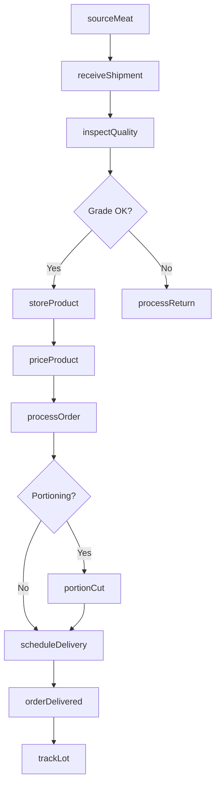
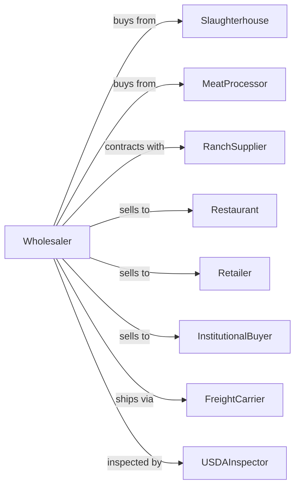

# Meat and Meat Product Merchant Wholesalers

> Business-as-Code definition for meat wholesale distribution operations. Models the complete cold chain from slaughterhouses and processors through restaurant and retail delivery.

## Overview

Meat and meat product merchant wholesalers distribute fresh, chilled, and processed meat products including beef, pork, lamb, and specialty meats to restaurants, grocery retailers, and foodservice operators. This definition exposes actions for meat procurement, USDA grading compliance, cold chain management, and order fulfillment with events for automated inventory rotation and food safety traceability.

## Actors

| Actor | Description |
|-------|-------------|
| Slaughterhouse | Federally inspected facility providing primal cuts |
| MeatProcessor | Facility producing processed and value-added products |
| RanchSupplier | Cattle, hog, or lamb producer selling live animals |
| Restaurant | Foodservice buyer purchasing meat for menu items |
| Retailer | Grocery store or butcher shop purchasing for resale |
| InstitutionalBuyer | Hospital, school, or cafeteria purchasing in volume |
| FreightCarrier | Refrigerated transport provider |
| USDAInspector | Federal inspector ensuring food safety and grading |

## Roles

| Role | Description |
|------|-------------|
| BuyingManager | Sources meat products and negotiates with suppliers |
| QualityInspector | Grades incoming product and verifies USDA compliance |
| WarehouseManager | Oversees cold storage operations and inventory |
| SalesRepresentative | Manages customer accounts and takes orders |
| DeliveryDriver | Operates refrigerated trucks for local delivery |
| ComplianceOfficer | Maintains HACCP records and traceability documentation |
| Boxman | Breaks down primal cuts into subprimals and portions in the wholesale cutting room |

## Entities

| Entity | Description |
|--------|-------------|
| MeatLot | Batch of meat with source, grade, and inspection stamps |
| Product | Specific cut, species, and preparation (primal, subprimal, portion) |
| Inventory | Current stock levels by product and storage location |
| PurchaseOrder | Customer order specifying products and quantities |
| ColdStorage | Refrigerated or frozen warehouse space |
| USDAGrade | Quality grade (Prime, Choice, Select) per USDA standards |
| SupplierContract | Agreement with slaughterhouse or processor |
| ShipmentManifest | Documentation for incoming or outgoing loads |
| TraceabilityRecord | Chain of custody from farm to customer |
| PriceList | Current wholesale prices by product and volume |

## Actions

| Action | Description |
|--------|-------------|
| sourceMeat | Procure meat from slaughterhouses or processors |
| receiveShipment | Accept delivery and verify against manifest |
| inspectQuality | Verify USDA grade and check for defects |
| storeProduct | Place in appropriate cold storage location |
| processOrder | Pick, pack, and prepare customer order |
| priceProduct | Set wholesale prices based on market conditions |
| scheduleDelivery | Arrange refrigerated transport to customer |
| rotateInventory | Move older stock forward using FIFO |
| trackLot | Maintain traceability from source to delivery |
| processReturn | Handle rejected or returned product |
| generateReport | Produce sales, inventory, or compliance reports |
| portionCut | Break down primals into customer-specified portions |

## Events

| Event | Description |
|-------|-------------|
| meatReceived | Meat lot arrived from supplier |
| shipmentInspected | Quality and grade verification completed |
| productStored | Meat placed in cold storage |
| orderReceived | Customer purchase order submitted |
| orderPicked | Products selected and staged for delivery |
| orderShipped | Delivery departed for customer |
| orderDelivered | Customer confirmed receipt |
| inventoryLow | Stock fell below reorder threshold |
| lotExpiring | Product approaching shelf life limit |
| priceUpdated | Wholesale pricing changed |
| qualityAlert | Product failed inspection or grade verification |
| recallIssued | USDA or supplier issued product recall |

## Searches

| Search | Description |
|--------|-------------|
| findProducts | Search catalog by cut, species, or grade |
| getInventory | Check stock levels by product and location |
| getOrders | Retrieve orders by customer, status, or date |
| trackShipment | Get delivery status and ETA |
| findSuppliers | Search suppliers by species or certification |
| getLotHistory | Trace product from farm to customer |
| getExpiringStock | List products by remaining shelf life |

## Workflow



## Actor Relationships



## Usage

### Calling Actions

```typescript
import { distributeMeat } from '@headlessly/distribute-meat'

const wholesaler = distributeMeat()

// Receive meat from slaughterhouse
const lot = await wholesaler.sourceMeat({
  supplierId: 'midwest-packing-co',
  species: 'beef',
  cut: 'ribeye-primal',
  weight: 2000,
  grade: 'choice',
  packDate: '2024-02-10'
})

// Inspect and verify grade
const inspection = await wholesaler.inspectQuality({
  lotId: lot.id,
  metrics: ['temperature', 'marbling', 'color', 'usda-stamp'],
  inspector: 'inspector-smith'
})

// Process customer order with portioning
await wholesaler.processOrder({
  customerId: 'steakhouse-prime',
  items: [
    { productId: 'ribeye-steak', quantity: 100, unit: 'lb', portion: '12oz' },
    { productId: 'ground-beef-80-20', quantity: 50, unit: 'lb' }
  ],
  deliveryDate: '2024-02-12',
  deliveryWindow: 'morning'
})
```

### Event-Driven Automation

```typescript
// Auto-discount expiring inventory
wholesaler.lotExpiring(async ({ lotId, daysRemaining, product }) => {
  if (daysRemaining <= 3) {
    await wholesaler.priceProduct({
      productId: product.id,
      discount: 0.20,
      reason: 'clearance'
    })
  }
})

// Auto-respond to recall
wholesaler.recallIssued(async ({ recallId, affectedLots }) => {
  for (const lotId of affectedLots) {
    await wholesaler.trackLot({ lotId })
    // Notify affected customers and quarantine inventory
  }
})
```
