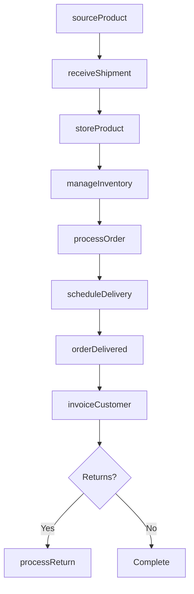
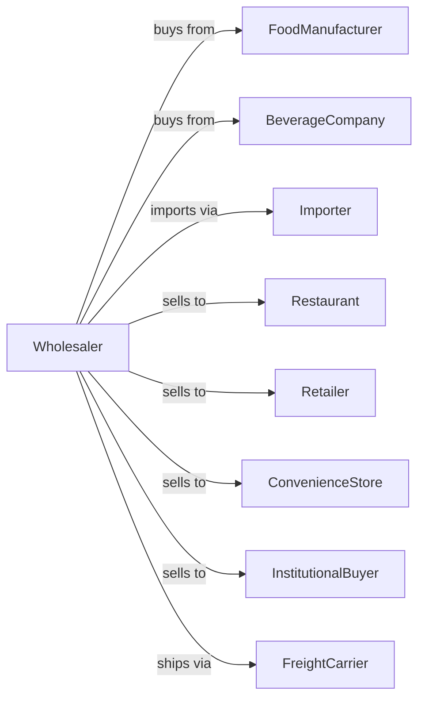

# Other Grocery and Related Products Merchant Wholesalers

> Business-as-Code definition for specialty grocery wholesale distribution operations. Models the complete supply chain for canned goods, dry goods, beverages, and specialty food items.

## Overview

Other grocery merchant wholesalers distribute specialty food products including canned goods, dry goods, bottled water, soft drinks, coffee, tea, spices, and specialty items to restaurants, grocery retailers, and foodservice operators. This definition exposes actions for product procurement, warehouse management, and order fulfillment with events for automated inventory replenishment and promotional pricing.

## Actors

| Actor | Description |
|-------|-------------|
| FoodManufacturer | Producer of packaged and processed food products |
| BeverageCompany | Producer of bottled water, soft drinks, and beverages |
| Importer | Brings specialty and international food products |
| Restaurant | Foodservice buyer purchasing ingredients and supplies |
| Retailer | Grocery store or specialty market purchasing for resale |
| ConvenienceStore | Small-format retailer purchasing high-velocity items |
| InstitutionalBuyer | Hospital, school, or cafeteria purchasing in volume |
| FreightCarrier | Trucking company providing delivery services |

## Roles

| Role | Description |
|------|-------------|
| CategoryManager | Manages product assortment and vendor relationships |
| BuyingManager | Negotiates pricing and terms with suppliers |
| WarehouseManager | Oversees storage operations and inventory |
| SalesRepresentative | Manages customer accounts and takes orders |
| DeliveryDriver | Operates delivery trucks for local routes |
| InventoryAnalyst | Monitors stock levels and forecasts demand |

## Entities

| Entity | Description |
|--------|-------------|
| Product | SKU with brand, size, and UPC code |
| Inventory | Current stock levels by product and warehouse location |
| PurchaseOrder | Customer order specifying products and quantities |
| Warehouse | Storage facility with dry, cooler, and freezer sections |
| Vendor | Supplier profile with terms and lead times |
| PriceList | Current wholesale prices and promotional deals |
| DeliveryRoute | Optimized sequence of customer stops |
| Invoice | Billing document for customer order |
| Promotion | Temporary price reduction or deal structure |
| Category | Product grouping for assortment management |

## Actions

| Action | Description |
|--------|-------------|
| sourceProduct | Procure products from manufacturers or importers |
| receiveShipment | Accept delivery and verify against purchase order |
| storeProduct | Place in appropriate warehouse location |
| processOrder | Pick, pack, and prepare customer order |
| priceProduct | Set wholesale prices and manage promotions |
| scheduleDelivery | Plan delivery routes and assign drivers |
| invoiceCustomer | Generate and send billing for orders |
| manageInventory | Monitor stock levels and trigger reorders |
| processReturn | Handle damaged or expired product returns |
| runPromotion | Execute manufacturer promotions and deals |
| auditInventory | Conduct physical counts and reconcile variances |
| onboardVendor | Set up new supplier in system |

## Events

| Event | Description |
|-------|-------------|
| shipmentReceived | Product arrived from supplier |
| productStored | Items placed in warehouse location |
| orderReceived | Customer purchase order submitted |
| orderPicked | Products selected and staged for delivery |
| orderShipped | Delivery departed for customer |
| orderDelivered | Customer confirmed receipt |
| inventoryLow | Stock fell below reorder point |
| inventoryExpiring | Products approaching best-by date |
| priceUpdated | Wholesale pricing changed |
| promotionStarted | New promotional deal activated |
| promotionEnded | Promotional deal expired |
| returnProcessed | Customer return completed |

## Searches

| Search | Description |
|--------|-------------|
| findProducts | Search catalog by category, brand, or keyword |
| getInventory | Check stock levels by product and location |
| getOrders | Retrieve orders by customer, status, or date |
| trackDelivery | Get delivery status and ETA |
| findVendors | Search suppliers by category or product |
| getPromotions | View active and upcoming promotional deals |
| getExpiringStock | List products by remaining shelf life |

## Workflow



## Actor Relationships



## Usage

### Calling Actions

```typescript
import { distributeGrocery } from '@headlessly/distribute-grocery'

const wholesaler = distributeGrocery()

// Search catalog by category, brand, or keyword
const findProductsResult = await wholesaler.findProducts({ category: 'featured', inStock: true })

// Check stock levels by product and location
const getInventoryResult = await wholesaler.getInventory({ status: 'available', category: 'main' })

// Source products from manufacturer
const shipment = await wholesaler.sourceProduct({
  vendorId: 'national-brands-inc',
  products: [
    { sku: 'soup-tomato-10oz', quantity: 500, unit: 'case' },
    { sku: 'beans-black-15oz', quantity: 300, unit: 'case' }
  ],
  deliveryDate: '2024-02-15'
})

// Process customer order
await wholesaler.processOrder({
  customerId: 'corner-grocery-123',
  items: [
    { productId: 'soup-tomato-10oz', quantity: 10, unit: 'case' },
    { productId: 'coffee-ground-12oz', quantity: 5, unit: 'case' }
  ],
  deliveryDate: '2024-02-12',
  deliveryWindow: 'morning'
})

// Run manufacturer promotion
await wholesaler.runPromotion({
  vendorId: 'national-brands-inc',
  products: ['soup-tomato-10oz', 'soup-chicken-10oz'],
  discount: 0.15,
  startDate: '2024-02-01',
  endDate: '2024-02-28'
})
```

### Event-Driven Automation

```typescript
// Auto-reorder when inventory low
wholesaler.inventoryLow(async ({ productId, currentStock, reorderPoint }) => {
  const vendor = await wholesaler.findVendors({ product: productId })
  await wholesaler.sourceProduct({
    vendorId: vendor[0].id,
    products: [{ sku: productId, quantity: reorderPoint * 2 }]
  })
})

// Auto-discount expiring inventory
wholesaler.inventoryExpiring(async ({ productId, daysRemaining }) => {
  if (daysRemaining <= 30) {
    await wholesaler.priceProduct({
      productId,
      discount: 0.25,
      reason: 'clearance'
    })
  }
})
```
