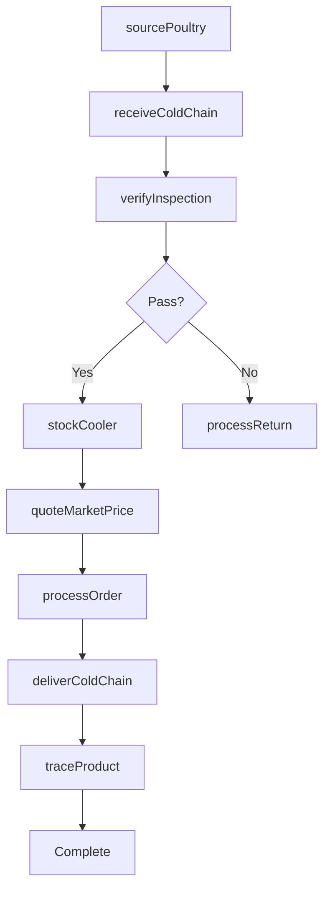
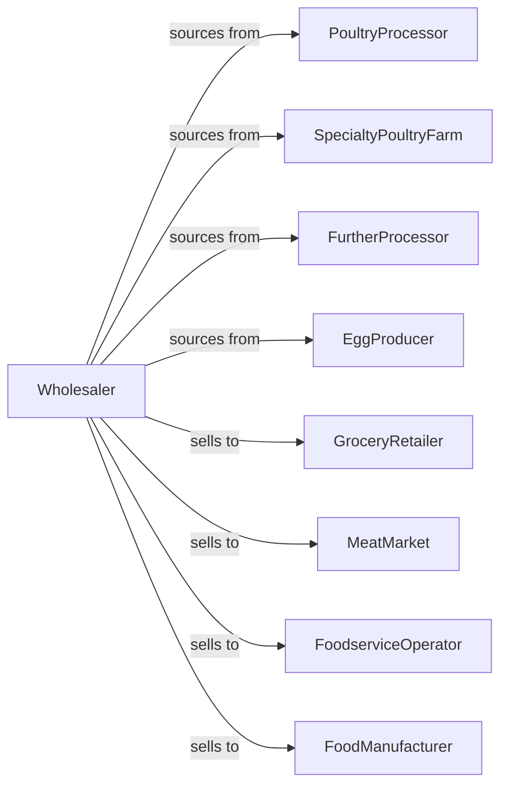

# Poultry and Poultry Product Merchant Wholesalers

> Business-as-Code definition for fresh poultry wholesale distribution. Models cold chain logistics, USDA compliance, and fulfillment for chicken, turkey, and specialty poultry products.

## Overview

Poultry wholesalers distribute fresh and fresh-frozen chicken, turkey, duck, and specialty poultry to grocers, foodservice operators, and meat processors. This definition exposes actions for poultry sourcing, USDA inspection compliance, and temperature-controlled fulfillment with events for market pricing and food safety tracking.

## Actors

| Actor | Description |
|-------|-------------|
| PoultryProcessor | Processes chicken and turkey |
| SpecialtyPoultryFarm | Raises duck, game birds |
| FurtherProcessor | Creates value-added poultry products |
| EggProducer | Supplies shell and processed eggs |
| GroceryRetailer | Sells poultry to consumers |
| MeatMarket | Specialty butcher or meat counter |
| FoodserviceOperator | Restaurant using poultry |
| FoodManufacturer | Uses poultry as ingredient |

## Roles

| Role | Description |
|------|-------------|
| PoultryBuyer | Sources from processors |
| SalesRepresentative | Serves retail and foodservice accounts |
| FoodSafetyCoordinator | Manages USDA compliance |
| ColdChainSpecialist | Oversees temperature control |
| MarketAnalyst | Tracks poultry commodity pricing |
| USDAInspectorLiaison | Coordinates with federal inspectors on grade certification and compliance |

## Entities

| Entity | Description |
|--------|-------------|
| Product | Poultry item with specs and grade |
| Inventory | Stock levels with lot and date |
| PurchaseOrder | Order placed with processor |
| SalesOrder | Customer order |
| Lot | Traceable production batch |
| USDAInspection | Federal inspection record |
| ColdChain | Temperature-controlled supply chain |
| PriceQuote | Market-based pricing |
| Specification | Customer product requirements |
| Return | Customer return or credit |

## Actions

| Action | Description |
|--------|-------------|
| sourcePoultry | Contract with processors |
| placeOrder | Submit purchase order |
| receiveColdChain | Check in with inspection |
| stockCooler | Store in refrigerated warehouse |
| quoteMarketPrice | Price based on commodity |
| processOrder | Fulfill customer order |
| deliverColdChain | Transport refrigerated |
| verifyInspection | Confirm USDA compliance |
| traceProduct | Track lot through supply chain |
| processReturn | Handle returns and credits |
| trackPricing | Monitor commodity market |
| specifyProduct | Define custom product specs |
| forecastDemand | Project customer requirements |
| manageRecall | Execute product recall |

## Events

| Event | Description |
|-------|-------------|
| orderReceived | Customer placed order |
| inventoryReceived | Processor shipment arrived |
| inspectionVerified | USDA compliance confirmed |
| orderDelivered | Products delivered |
| priceChanged | Commodity market shifted |
| temperatureExcursion | Cold chain breach |
| recallAnnounced | Product recall issued |
| lotTraced | Product traced through chain |
| specificationMet | Custom product delivered |
| creditIssued | Return credit processed |
| stockLow | Inventory below threshold |
| returnProcessed | Return completed |

## Searches

| Search | Description |
|--------|-------------|
| findProducts | Search by type, cut, grade |
| getInventory | Check stock with lot tracking |
| getOrders | Retrieve orders by status |
| getPricing | View current market prices |
| getLots | Track product batches |
| getInspections | Access USDA records |
| getSpecifications | View custom product specs |

## Workflow



## Actor Relationships



## Usage

### Calling Actions

```typescript
import { distributePoultryPoultry } from '@headlessly/distribute-poultry-poultry'

const distributor = distributePoultryPoultry()

// Search poultry inventory
const chicken = await distributor.findProducts({
  type: 'chicken',
  cut: 'breast-boneless',
  grade: 'A',
  weight: { min: 6, max: 8, unit: 'oz' },
  fresh: true
})

// Quote at market price
const quote = await distributor.quoteMarketPrice({
  customerId: 'restaurant-456',
  items: [
    { productId: chicken[0].id, quantity: 500, unit: 'lbs' }
  ],
  priceType: 'spot'
})

// Process order with traceability
await distributor.processOrder({
  customerId: 'restaurant-456',
  quoteId: quote.id,
  delivery: {
    date: '2024-04-15',
    temperatureRange: { min: 28, max: 40, unit: 'fahrenheit' }
  },
  traceability: {
    lotTracking: true,
    certifications: ['usda-inspected', 'no-antibiotics']
  }
})
```

### Event-Driven Automation

```typescript
// Execute recall immediately
distributor.recallAnnounced(async ({ lotNumbers, reason, severity }) => {
  const affectedCustomers = await getCustomersWithLots(lotNumbers)

  for (const customer of affectedCustomers) {
    await notifyCustomer({
      customerId: customer.id,
      urgency: 'critical',
      message: `RECALL: Lots ${lotNumbers.join(', ')} - ${reason}`
    })
  }

  await distributor.manageRecall({
    lotNumbers,
    action: 'quarantine-and-return'
  })
})

// Track market price changes
distributor.priceChanged(async ({ product, oldPrice, newPrice, changePercent }) => {
  if (Math.abs(changePercent) > 5) {
    const customers = await getCustomersWithContracts(product)

    await notifyPriceChange({
      customers,
      product,
      change: changePercent
    })
  }
})
```
