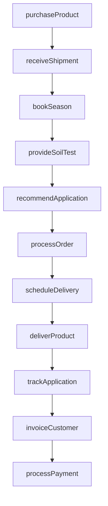
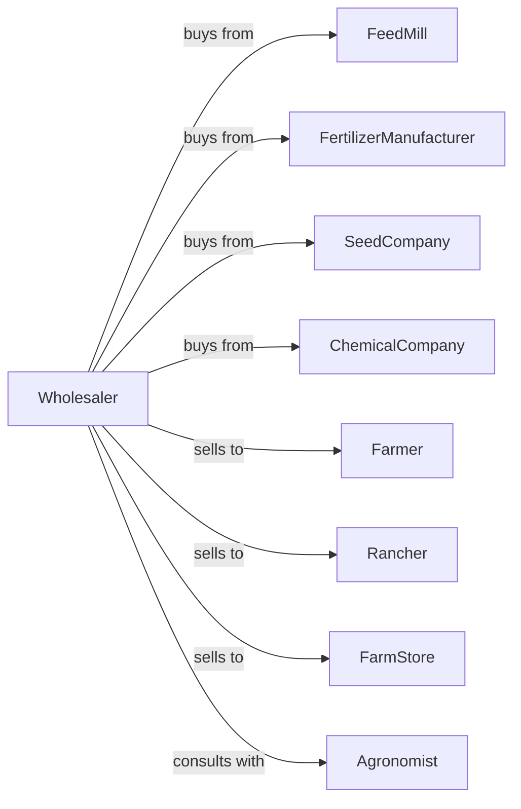

# Farm Supplies Merchant Wholesalers

> Business-as-Code definition for agricultural supply wholesale operations. Models the complete distribution cycle for feed, fertilizer, seed, and crop protection products.

## Overview

Farm supplies merchant wholesalers distribute animal feed, fertilizers, seeds, pesticides, and agricultural chemicals to farmers, ranchers, and agricultural retailers. This definition exposes actions for seasonal product procurement, inventory management, agronomic support, and order fulfillment with events for automated replenishment and application timing.

## Actors

| Actor | Description |
|-------|-------------|
| FeedMill | Producer of livestock and poultry feeds |
| FertilizerManufacturer | Producer of nitrogen, phosphate, and potash products |
| SeedCompany | Developer and supplier of crop seeds |
| ChemicalCompany | Producer of herbicides, pesticides, and fungicides |
| Farmer | Crop producer purchasing inputs for production |
| Rancher | Livestock producer purchasing feed and supplies |
| FarmStore | Retail dealer selling to local farmers |
| Agronomist | Provides crop consulting and recommendations |

## Roles

| Role | Description |
|------|-------------|
| SalesRepresentative | Manages farmer accounts and takes orders |
| AgronomicAdvisor | Provides technical support on product application |
| WarehouseManager | Oversees storage and inventory operations |
| DeliveryDriver | Operates trucks for farm delivery |
| PurchasingManager | Procures products from manufacturers |
| CreditManager | Manages farmer accounts and operating loans |

## Entities

| Entity | Description |
|--------|-------------|
| Product | Feed, fertilizer, seed, or chemical SKU |
| Inventory | Current stock by product and warehouse location |
| CustomerAccount | Farmer or rancher profile with credit terms |
| SalesOrder | Customer order specifying products and quantities |
| SeasonalProgram | Pre-season booking with volume discounts |
| DeliveryTicket | Documentation for farm delivery |
| SoilTest | Analysis results for fertilizer recommendations |
| Application | Scheduled product application to fields |
| CropPlan | Season plan with inputs by field |
| Invoice | Billing document for delivered products |

## Actions

| Action | Description |
|--------|-------------|
| purchaseProduct | Order supplies from manufacturer |
| receiveShipment | Accept delivery into warehouse |
| bookSeason | Take pre-season orders at program pricing |
| processOrder | Pick and prepare customer order |
| scheduleDelivery | Plan farm delivery with appropriate equipment |
| deliverProduct | Transport and unload at farm site |
| provideSoilTest | Coordinate soil sampling and analysis |
| recommendApplication | Advise on product rates and timing |
| invoiceCustomer | Generate billing for delivered products |
| processPayment | Collect payment or apply to credit account |
| trackApplication | Record product application by field |
| reportSales | Submit volume data to manufacturers |

## Events

| Event | Description |
|-------|-------------|
| shipmentReceived | Product arrived from manufacturer |
| productStored | Inventory placed in warehouse |
| seasonBooked | Pre-season order confirmed |
| orderReceived | In-season order submitted |
| orderDelivered | Products delivered to farm |
| soilTestComplete | Analysis results available |
| applicationScheduled | Product application planned |
| applicationComplete | Field treatment completed |
| invoiceSent | Billing transmitted to customer |
| paymentReceived | Customer payment processed |
| inventoryLow | Stock fell below reorder point |
| seasonStarted | Planting or application season began |

## Searches

| Search | Description |
|--------|-------------|
| findProducts | Search catalog by category, brand, or use |
| getInventory | Check stock levels by product and location |
| getCustomers | Search farmer and rancher accounts |
| getOrders | Retrieve orders by customer, status, or date |
| getSeasonalBookings | View pre-season orders and commitments |
| getSoilTests | Retrieve soil analysis by farm or field |
| getApplicationHistory | View product applications by field |

## Workflow



## Actor Relationships



## Usage

### Calling Actions

```typescript
import { wholesaleFarmSupplies } from '@headlessly/wholesale-farm-supplies'

const distributor = wholesaleFarmSupplies()

// Search catalog by category, brand, or use
const findProductsResult = await distributor.findProducts({ category: 'featured', inStock: true })

// Check stock levels by product and location
const getInventoryResult = await distributor.getInventory({ status: 'available', category: 'main' })

// Book seasonal program
const booking = await distributor.bookSeason({
  customerId: 'johnson-farms',
  season: '2024-spring',
  items: [
    { productId: 'corn-seed-123', quantity: 50, unit: 'bag' },
    { productId: 'urea-46-0-0', quantity: 20, unit: 'ton' },
    { productId: 'roundup-ready', quantity: 100, unit: 'gal' }
  ],
  programDiscount: 0.08
})

// Provide soil test
await distributor.provideSoilTest({
  customerId: 'johnson-farms',
  fieldId: 'north-40',
  tests: ['pH', 'nitrogen', 'phosphorus', 'potassium', 'organicMatter']
})

// Recommend application based on results
await distributor.recommendApplication({
  customerId: 'johnson-farms',
  fieldId: 'north-40',
  recommendations: [
    { product: 'urea-46-0-0', rate: 180, unit: 'lb-N/acre' },
    { product: 'potash-0-0-60', rate: 60, unit: 'lb-K/acre' }
  ]
})
```

### Event-Driven Automation

```typescript
// Auto-notify on season start
distributor.seasonStarted(async ({ season, region }) => {
  const bookings = await distributor.getSeasonalBookings({ season, region })
  for (const booking of bookings) {
    await notifyCustomer({
      customerId: booking.customerId,
      message: `Your ${season} order is ready for delivery scheduling`
    })
  }
})

// Auto-reorder on low inventory
distributor.inventoryLow(async ({ productId, currentStock }) => {
  const manufacturer = await getPreferredSupplier(productId)
  await distributor.purchaseProduct({
    supplierId: manufacturer.id,
    products: [{ sku: productId, quantity: currentStock * 2 }]
  })
})
```
