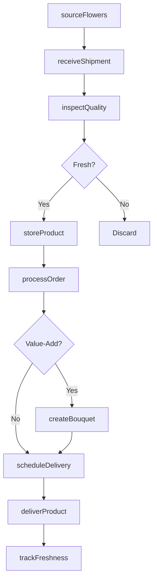
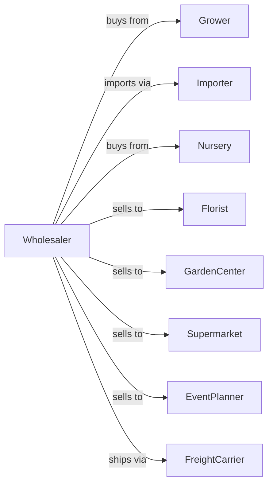

# Flower, Nursery Stock, and Florists' Supplies Merchant Wholesalers

> Business-as-Code definition for floral and nursery wholesale operations. Models the complete cold chain from growers and importers through florist and garden center delivery.

## Overview

Flower, nursery stock, and florists' supplies merchant wholesalers distribute cut flowers, potted plants, nursery stock, and floral supplies to florists, garden centers, and retailers. This definition exposes actions for perishable product procurement, cold chain management, and rapid delivery with events for automated inventory rotation and seasonal demand planning.

## Actors

| Actor | Description |
|-------|-------------|
| Grower | Domestic flower or plant producer |
| Importer | Brings flowers from international growing regions |
| Nursery | Producer of trees, shrubs, and landscape plants |
| Florist | Retail flower shop purchasing fresh flowers |
| GardenCenter | Retail nursery selling plants to consumers |
| Supermarket | Grocery store with floral department |
| EventPlanner | Buyer for weddings, events, and corporate accounts |
| FreightCarrier | Refrigerated transport provider |

## Roles

| Role | Description |
|------|-------------|
| BuyingManager | Sources flowers and manages grower relationships |
| QualityInspector | Grades incoming product for freshness |
| WarehouseManager | Oversees cold storage and processing operations |
| SalesRepresentative | Manages florist and retail accounts |
| DeliveryDriver | Operates refrigerated trucks for delivery |
| FloralDesigner | Provides value-added arrangements and bouquets |
| PostharvestSpecialist | Manages flower hydration, temperature, and ethylene treatment for maximum vase life |

## Entities

| Entity | Description |
|--------|-------------|
| FlowerLot | Batch of cut flowers with origin and grade |
| PlantLot | Group of potted plants or nursery stock |
| Product | Specific variety, color, and stem length |
| Inventory | Current stock by product and cooler location |
| PurchaseOrder | Customer order specifying products and quantities |
| ColdStorage | Refrigerated warehouse space for perishables |
| PriceList | Current wholesale prices by product |
| HolidayProgram | Pre-book for Valentine's, Mother's Day, etc |
| SupplyItem | Containers, foam, ribbon, and floral supplies |
| QualityGrade | Freshness rating based on inspection |

## Actions

| Action | Description |
|--------|-------------|
| sourceFlowers | Procure cut flowers from growers or importers |
| sourceNursery | Order trees, shrubs, and plants from nurseries |
| receiveShipment | Accept delivery into cold storage |
| inspectQuality | Grade freshness and check for damage |
| storeProduct | Place in appropriate cooler or holding area |
| processOrder | Pick, bunch, and prepare customer order |
| createBouquet | Assemble value-added arrangements |
| priceProduct | Set wholesale prices based on market |
| scheduleDelivery | Plan refrigerated delivery route |
| deliverProduct | Transport to florist or retail account |
| bookHoliday | Take pre-orders for holiday peaks |
| trackFreshness | Monitor days since harvest for rotation |

## Events

| Event | Description |
|-------|-------------|
| shipmentReceived | Flowers or plants arrived from supplier |
| productInspected | Quality grading completed |
| productStored | Items placed in cold storage |
| orderReceived | Customer purchase order submitted |
| orderPicked | Products selected and staged |
| orderDelivered | Delivery completed at customer |
| inventoryLow | Stock fell below reorder point |
| productExpiring | Items approaching freshness limit |
| priceUpdated | Wholesale pricing changed |
| holidayBooked | Pre-order confirmed for peak |
| seasonStarted | Holiday or seasonal peak began |
| qualityAlert | Product failed freshness inspection |

## Searches

| Search | Description |
|--------|-------------|
| findProducts | Search catalog by variety, color, or type |
| getInventory | Check stock levels by product and location |
| getOrders | Retrieve orders by customer, status, or date |
| trackShipment | Get delivery status and ETA |
| findSuppliers | Search growers by product or region |
| getHolidayBookings | View pre-orders for upcoming peaks |
| getExpiringStock | List products by remaining freshness |

## Workflow



## Actor Relationships



## Usage

### Calling Actions

```typescript
import { wholesaleFlowers } from '@headlessly/wholesale-flowers'

const distributor = wholesaleFlowers()

// Search catalog by variety, color, or type
const findProductsResult = await distributor.findProducts({ category: 'featured', inStock: true })

// Check stock levels by product and location
const getInventoryResult = await distributor.getInventory({ status: 'available', category: 'main' })

// Source roses from grower
const lot = await distributor.sourceFlowers({
  supplierId: 'ecuador-rose-farm',
  products: [
    { variety: 'red-rose', stemLength: 60, quantity: 2500, unit: 'stem' },
    { variety: 'white-rose', stemLength: 50, quantity: 1500, unit: 'stem' }
  ],
  harvestDate: '2024-02-08',
  arrivalDate: '2024-02-10'
})

// Process florist order
await distributor.processOrder({
  customerId: 'downtown-florist',
  items: [
    { productId: 'red-rose-60cm', quantity: 100, unit: 'stem' },
    { productId: 'baby-breath', quantity: 50, unit: 'bunch' }
  ],
  deliveryDate: '2024-02-12',
  deliveryWindow: 'early-morning'
})

// Book holiday pre-order
await distributor.bookHoliday({
  customerId: 'downtown-florist',
  holiday: 'valentines-2024',
  items: [
    { productId: 'red-rose-60cm', quantity: 500, unit: 'stem' },
    { productId: 'premium-dozen-box', quantity: 25, unit: 'each' }
  ]
})
```

### Event-Driven Automation

```typescript
// Auto-discount expiring inventory
distributor.productExpiring(async ({ productId, daysRemaining }) => {
  if (daysRemaining <= 2) {
    await distributor.priceProduct({
      productId,
      discount: 0.40,
      reason: 'quick-sale'
    })
  }
})

// Auto-alert on holiday demand
distributor.seasonStarted(async ({ holiday }) => {
  const bookings = await distributor.getHolidayBookings({ holiday })
  const inventory = await distributor.getInventory()

  const shortages = calculateShortages(bookings, inventory)
  if (shortages.length > 0) {
    await emergencySource(shortages)
  }
})
```
