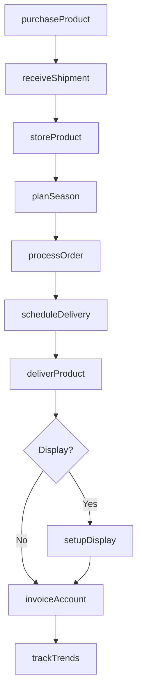
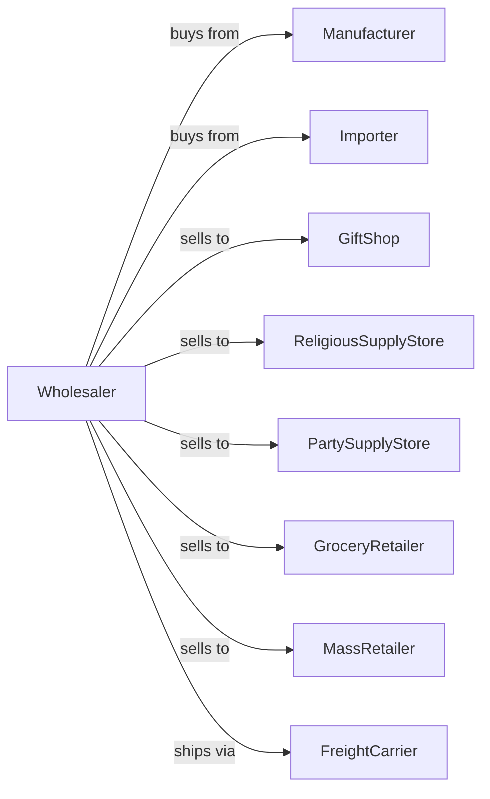

# Other Miscellaneous Nondurable Goods Merchant Wholesalers

> Business-as-Code definition for specialty nondurable goods wholesale operations. Models the distribution of candles, novelties, religious goods, and other miscellaneous consumables.

## Overview

Other miscellaneous nondurable goods merchant wholesalers distribute specialty products including candles, novelties, religious articles, fireworks, and miscellaneous consumables to retailers and specialty shops. This definition exposes actions for product procurement, seasonal inventory management, and order fulfillment with events for automated demand planning and promotional coordination.

## Actors

| Actor | Description |
|-------|-------------|
| Manufacturer | Producer of candles, novelties, or specialty goods |
| Importer | Brings international specialty products to market |
| GiftShop | Specialty retailer selling novelties and gifts |
| ReligiousSupplyStore | Retailer of religious articles and supplies |
| PartySupplyStore | Retailer of novelties and celebration items |
| GroceryRetailer | Supermarket with seasonal merchandise |
| MassRetailer | Big box store with variety departments |
| FreightCarrier | Trucking company for delivery |

## Roles

| Role | Description |
|------|-------------|
| BuyingManager | Sources products and manages vendor relationships |
| CategoryManager | Oversees product assortment and trends |
| SalesRepresentative | Manages retail accounts and takes orders |
| WarehouseManager | Oversees inventory and distribution operations |
| DeliveryDriver | Operates delivery trucks to retail accounts |
| MerchandiserRep | Sets up displays and seasonal programs |

## Entities

| Entity | Description |
|--------|-------------|
| Product | SKU with brand, category, and specifications |
| Inventory | Current stock by product and warehouse location |
| RetailAccount | Store profile with purchasing patterns |
| PurchaseOrder | Customer order specifying products and quantities |
| SeasonalProgram | Holiday or seasonal buying program |
| DeliveryRoute | Optimized sequence of delivery stops |
| Invoice | Billing document for delivered products |
| PriceList | Current pricing by product and volume tier |
| Promotion | Deal or display program from supplier |
| Display | Merchandising fixture or seasonal setup |

## Actions

| Action | Description |
|--------|-------------|
| purchaseProduct | Order specialty goods from manufacturers |
| receiveShipment | Accept delivery into warehouse |
| storeProduct | Place in appropriate warehouse location |
| planSeason | Develop seasonal buying and merchandising plan |
| processOrder | Pick and prepare customer order |
| priceProduct | Set pricing based on market and season |
| scheduleDelivery | Plan delivery route for retail accounts |
| deliverProduct | Transport to customer locations |
| setupDisplay | Install seasonal merchandising at retail |
| invoiceAccount | Generate billing for delivered products |
| processReturn | Handle unsold or damaged product returns |
| trackTrends | Monitor sales patterns and market trends |

## Events

| Event | Description |
|-------|-------------|
| shipmentReceived | Product arrived from supplier |
| productStored | Inventory placed in warehouse |
| orderReceived | Retail account submitted order |
| orderPicked | Products selected and staged |
| orderDelivered | Products delivered to customer |
| displayInstalled | Seasonal merchandising set up |
| invoiceSent | Billing transmitted to customer |
| paymentReceived | Customer payment processed |
| inventoryLow | Stock fell below reorder point |
| seasonStarted | Holiday or seasonal period began |
| seasonEnded | Seasonal period concluded |
| returnProcessed | Product return completed |

## Searches

| Search | Description |
|--------|-------------|
| findProducts | Search catalog by category, brand, or keyword |
| getInventory | Check stock levels by product and location |
| getAccounts | Search retail accounts by type or territory |
| getOrders | Retrieve orders by customer, status, or date |
| getSeasonalPlans | View upcoming seasonal programs |
| getSalesHistory | Retrieve sales data by product or account |
| getTrendData | Access market trend analysis |

## Workflow



## Actor Relationships



## Usage

### Calling Actions

```typescript
import { wholesaleNondurableGoods } from '@headlessly/wholesale-nondurable-goods'

const distributor = wholesaleNondurableGoods()

// Search catalog by category, brand, or keyword
const findProductsResult = await distributor.findProducts({ category: 'featured', inStock: true })

// Check stock levels by product and location
const getInventoryResult = await distributor.getInventory({ status: 'available', category: 'main' })

// Purchase seasonal inventory
const order = await distributor.purchaseProduct({
  manufacturerId: 'candle-craft-co',
  products: [
    { sku: 'pillar-candle-vanilla', quantity: 500, unit: 'each' },
    { sku: 'votive-assorted-12pk', quantity: 200, unit: 'pack' }
  ],
  deliveryDate: '2024-10-01'
})

// Plan seasonal program
await distributor.planSeason({
  season: 'holiday-2024',
  category: 'candles',
  accounts: ['gift-shop-main', 'grocery-chain-west'],
  startDate: '2024-11-01',
  endDate: '2024-12-31'
})

// Process retail order
await distributor.processOrder({
  customerId: 'gift-shop-main',
  items: [
    { productId: 'pillar-candle-vanilla', quantity: 50, unit: 'each' },
    { productId: 'holiday-novelty-set', quantity: 25, unit: 'each' }
  ],
  deliveryDate: '2024-11-05'
})
```

### Event-Driven Automation

```typescript
// Auto-setup seasonal displays
distributor.seasonStarted(async ({ season, category }) => {
  const accounts = await distributor.getAccounts({ seasonalProgram: season })

  for (const account of accounts) {
    await distributor.setupDisplay({
      accountId: account.id,
      season,
      category,
      displayType: account.displayPreference
    })
  }
})

// Auto-process end-of-season returns
distributor.seasonEnded(async ({ season }) => {
  const unsold = await distributor.getInventory({
    season,
    status: 'at-retail'
  })

  for (const item of unsold) {
    await distributor.processReturn({
      accountId: item.accountId,
      productId: item.productId,
      quantity: item.remaining,
      reason: 'seasonal-closeout'
    })
  }
})
```
