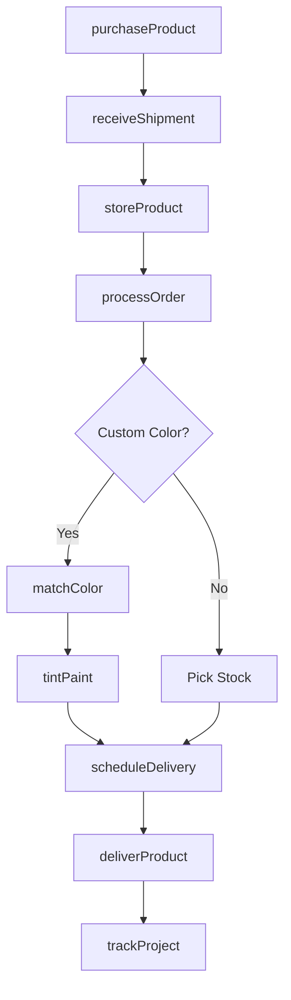
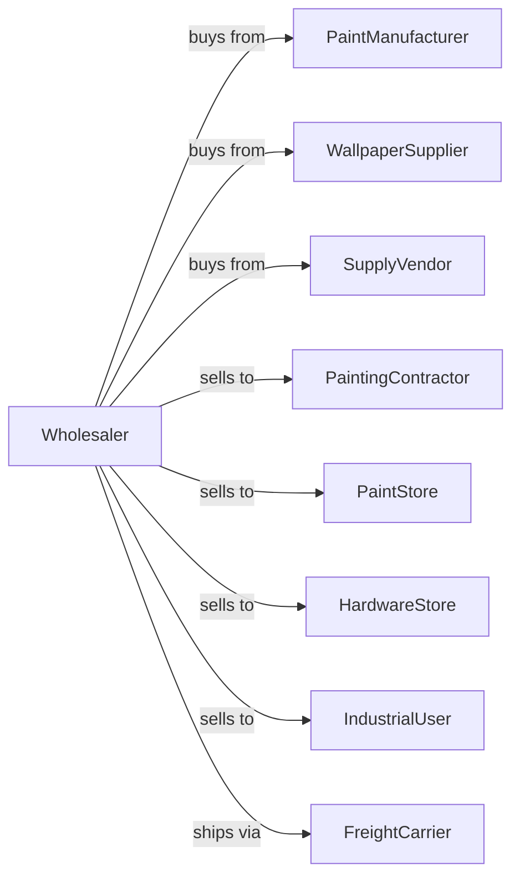

# Paint, Varnish, and Supplies Merchant Wholesalers

> Business-as-Code definition for paint and coatings wholesale distribution operations. Models the complete supply chain for paints, stains, coatings, and application supplies.

## Overview

Paint, varnish, and supplies merchant wholesalers distribute architectural and industrial coatings, stains, varnishes, wallpaper, and painting supplies to contractors, retailers, and industrial users. This definition exposes actions for product procurement, color matching, inventory management, and order fulfillment with events for automated replenishment and project support.

## Actors

| Actor | Description |
|-------|-------------|
| PaintManufacturer | Producer of paints, stains, and coatings |
| WallpaperSupplier | Producer of wall coverings and papers |
| SupplyVendor | Maker of brushes, rollers, and application tools |
| PaintingContractor | Professional painter purchasing supplies |
| PaintStore | Retail paint dealer and decorator |
| HardwareStore | Retailer with paint department |
| IndustrialUser | Manufacturer using coatings in production |
| FreightCarrier | Trucking company for delivery |

## Roles

| Role | Description |
|------|-------------|
| ProductManager | Manages coating lines and manufacturer relationships |
| ColorSpecialist | Provides color matching and custom tinting |
| SalesRepresentative | Manages contractor and retail accounts |
| WarehouseManager | Oversees inventory and distribution operations |
| DeliveryDriver | Operates delivery trucks to job sites and stores |
| TechnicalAdvisor | Provides application and product guidance |

## Entities

| Entity | Description |
|--------|-------------|
| Product | Paint, stain, or coating with specifications |
| ColorFormula | Custom tint recipe for color matching |
| Inventory | Current stock by product and location |
| PurchaseOrder | Customer order specifying products and quantities |
| JobAccount | Contractor project with specifications |
| PriceList | Current pricing by product and volume tier |
| TechnicalDataSheet | Product specifications and application guide |
| SafetyDataSheet | SDS for handling and disposal |
| TintBase | Base paint for custom color mixing |
| Sundry | Brushes, rollers, tape, and application supplies |

## Actions

| Action | Description |
|--------|-------------|
| purchaseProduct | Order paints and supplies from manufacturers |
| receiveShipment | Accept delivery into warehouse |
| storeProduct | Place in appropriate warehouse location |
| matchColor | Create custom color formula from sample |
| tintPaint | Mix base paint to color specification |
| processOrder | Pick and prepare customer order |
| priceProduct | Set pricing based on volume and account tier |
| scheduleDelivery | Plan delivery to store or job site |
| deliverProduct | Transport to customer location |
| provideTechSupport | Advise on product selection and application |
| processReturn | Handle unused or defective product returns |
| trackProject | Monitor contractor job progress and needs |

## Events

| Event | Description |
|-------|-------------|
| shipmentReceived | Product arrived from manufacturer |
| productStored | Inventory placed in warehouse |
| colorMatched | Custom formula created for customer |
| paintTinted | Custom color mixed and ready |
| orderReceived | Customer purchase order submitted |
| orderDelivered | Products delivered to customer |
| invoiceSent | Billing transmitted to customer |
| paymentReceived | Customer payment processed |
| inventoryLow | Stock fell below reorder point |
| projectStarted | Contractor job began requiring supplies |
| techSupportProvided | Product guidance given to customer |
| returnProcessed | Product return completed |

## Searches

| Search | Description |
|--------|-------------|
| findProducts | Search catalog by type, finish, or application |
| getInventory | Check stock levels by product and location |
| getColorFormulas | Retrieve saved custom color recipes |
| getAccounts | Search contractor and retail accounts |
| getOrders | Retrieve orders by customer, status, or date |
| getTechnicalData | Access product specifications and guides |
| getProjectHistory | View contractor job orders and history |

## Workflow



## Actor Relationships



## Usage

### Calling Actions

```typescript
import { wholesalePaint } from '@headlessly/wholesale-paint'

const distributor = wholesalePaint()

// Search catalog by type, finish, or application
const findProductsResult = await distributor.findProducts({ category: 'featured', inStock: true })

// Check stock levels by product and location
const getInventoryResult = await distributor.getInventory({ status: 'available', category: 'main' })

// Purchase from manufacturer
const order = await distributor.purchaseProduct({
  manufacturerId: 'sherwin-williams',
  products: [
    { sku: 'interior-latex-flat', quantity: 100, unit: 'gallon' },
    { sku: 'exterior-acrylic-satin', quantity: 50, unit: 'gallon' }
  ],
  deliveryDate: '2024-02-15'
})

// Match custom color for contractor
const formula = await distributor.matchColor({
  customerId: 'smith-painting-co',
  sampleType: 'paint-chip',
  colorName: 'client-custom-blue',
  baseProduct: 'interior-latex-flat'
})

// Process job site order
await distributor.processOrder({
  customerId: 'smith-painting-co',
  projectId: 'office-building-123',
  items: [
    { productId: 'interior-latex-flat', color: formula.id, quantity: 25, unit: 'gallon' },
    { productId: 'roller-cover-9in', quantity: 20, unit: 'each' }
  ],
  deliveryDate: '2024-02-17',
  deliveryLocation: 'job-site'
})
```

### Event-Driven Automation

```typescript
// Auto-reorder on low inventory
distributor.inventoryLow(async ({ productId, currentStock }) => {
  const manufacturer = await getPreferredSupplier(productId)
  await distributor.purchaseProduct({
    manufacturerId: manufacturer.id,
    products: [{ sku: productId, quantity: currentStock * 2 }]
  })
})

// Auto-notify contractor on project delivery
distributor.orderDelivered(async ({ customerId, projectId, items }) => {
  await notifyContractor({
    customerId,
    message: `Order delivered to ${projectId} - ${items.length} items`
  })

  await distributor.trackProject({
    projectId,
    status: 'supplies-delivered',
    deliveredItems: items
  })
})
```
