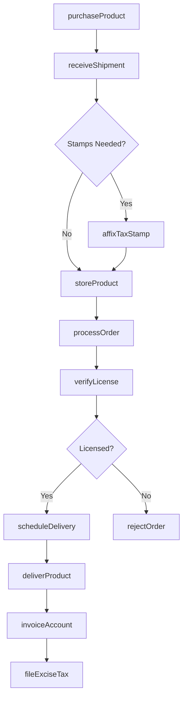
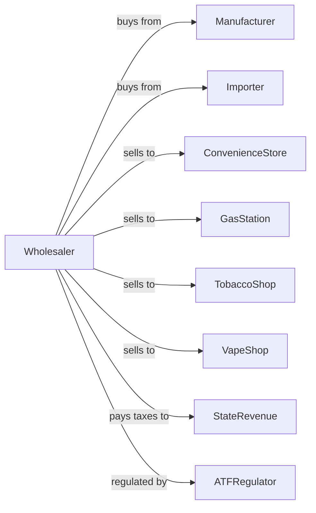

# Tobacco Product and Electronic Cigarette Merchant Wholesalers

> Business-as-Code definition for tobacco wholesale distribution operations. Models the complete regulated supply chain for cigarettes, cigars, and electronic cigarettes.

## Overview

Tobacco product merchant wholesalers distribute cigarettes, cigars, smokeless tobacco, and electronic cigarettes to convenience stores, gas stations, and tobacco retailers. This definition exposes actions for product procurement, excise tax compliance, age-restricted sales verification, and delivery with events for automated regulatory reporting and inventory management.

## Actors

| Actor | Description |
|-------|-------------|
| Manufacturer | Tobacco or e-cigarette producer supplying products |
| Importer | Brings international tobacco products to market |
| ConvenienceStore | C-store purchasing tobacco for resale |
| GasStation | Fuel retailer with tobacco counter |
| TobaccoShop | Specialty retailer selling cigars and tobacco |
| VapeShop | Retailer specializing in electronic cigarettes |
| StateRevenue | State tax authority collecting excise taxes |
| ATFRegulator | Federal Bureau of Alcohol, Tobacco, Firearms |

## Roles

| Role | Description |
|------|-------------|
| PurchasingManager | Procures products from manufacturers |
| ComplianceOfficer | Ensures excise tax and regulatory compliance |
| SalesRepresentative | Manages retail accounts and takes orders |
| WarehouseManager | Oversees inventory and distribution |
| DeliveryDriver | Operates delivery trucks to retail accounts |
| TaxAccountant | Prepares excise tax filings and payments |

## Entities

| Entity | Description |
|--------|-------------|
| Product | Cigarettes, cigars, or e-cigarettes with UPC and tax class |
| Inventory | Current stock by product and warehouse location |
| RetailAccount | Licensed retailer with age verification |
| SalesOrder | Customer order specifying products and quantities |
| TaxStamp | State excise tax stamp affixed to products |
| Invoice | Billing document including product and taxes |
| DeliveryRoute | Optimized sequence of delivery stops |
| PriceList | Current pricing by product including excise tax |
| ComplianceReport | Regulatory filing for sales and inventory |
| License | Wholesale tobacco license for state operations |

## Actions

| Action | Description |
|--------|-------------|
| purchaseProduct | Order tobacco products from manufacturer |
| receiveShipment | Accept delivery and verify tax stamps |
| affixTaxStamp | Apply state excise tax stamps if required |
| storeProduct | Place in secure warehouse location |
| processOrder | Pick and prepare customer order |
| verifyLicense | Confirm retail customer has valid tobacco license |
| scheduleDelivery | Plan delivery route for retail accounts |
| deliverProduct | Transport to licensed retail location |
| invoiceAccount | Generate billing with tax breakout |
| collectPayment | Process customer payment |
| fileExciseTax | Submit excise tax reports and payments |
| reportCompliance | File regulatory reports with authorities |

## Events

| Event | Description |
|-------|-------------|
| shipmentReceived | Tobacco products arrived from manufacturer |
| stampAffixed | Excise tax stamps applied to products |
| productStored | Inventory placed in warehouse |
| orderReceived | Retail account submitted order |
| licenseVerified | Customer tobacco license confirmed |
| orderDelivered | Products delivered to retailer |
| invoiceSent | Billing transmitted to customer |
| paymentReceived | Customer payment processed |
| inventoryLow | Stock fell below reorder point |
| taxFilingDue | Excise tax deadline approaching |
| taxFiled | Excise report submitted |
| licenseExpiring | Retail customer license nearing expiration |

## Searches

| Search | Description |
|--------|-------------|
| findProducts | Search catalog by brand, type, or category |
| getInventory | Check stock levels by product and location |
| getAccounts | Search retail accounts by type or territory |
| getOrders | Retrieve orders by customer, status, or date |
| getTaxFilings | View excise tax reports and payments |
| getLicenses | Check retail license status and expiration |
| getSalesHistory | Retrieve sales data by account or product |

## Workflow



## Actor Relationships



## Usage

### Calling Actions

```typescript
import { wholesaleTobacco } from '@headlessly/wholesale-tobacco'

const distributor = wholesaleTobacco()

// Search catalog by brand, type, or category
const findProductsResult = await distributor.findProducts({ category: 'featured', inStock: true })

// Check stock levels by product and location
const getInventoryResult = await distributor.getInventory({ status: 'available', category: 'main' })

// Purchase from manufacturer
const order = await distributor.purchaseProduct({
  manufacturerId: 'major-tobacco-co',
  products: [
    { sku: 'cigarette-brand-a', quantity: 500, unit: 'carton' },
    { sku: 'cigar-premium-box', quantity: 100, unit: 'box' }
  ],
  deliveryDate: '2024-02-15'
})

// Verify retailer license before order
const license = await distributor.verifyLicense({
  accountId: 'quickmart-station-5',
  licenseType: 'retail-tobacco',
  state: 'TX'
})

// Process retail order
await distributor.processOrder({
  customerId: 'quickmart-station-5',
  items: [
    { productId: 'cigarette-brand-a', quantity: 20, unit: 'carton' },
    { productId: 'vape-pod-menthol', quantity: 50, unit: 'pack' }
  ],
  deliveryDate: '2024-02-17'
})
```

### Event-Driven Automation

```typescript
// Auto-file excise tax on deadline
distributor.taxFilingDue(async ({ state, period, dueDate }) => {
  const sales = await distributor.getSalesHistory({
    state,
    period,
    groupBy: 'taxClass'
  })

  await distributor.fileExciseTax({
    state,
    period,
    sales,
    paymentMethod: 'ach'
  })
})

// Auto-alert on expiring licenses
distributor.licenseExpiring(async ({ accountId, licenseId, daysRemaining }) => {
  if (daysRemaining <= 30) {
    await notifyAccount({
      accountId,
      message: `Tobacco license expires in ${daysRemaining} days - please renew`
    })
  }
})
```
