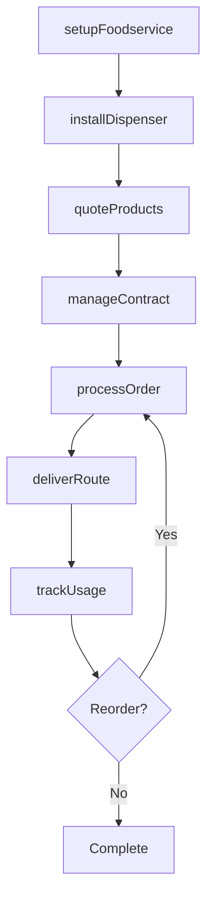
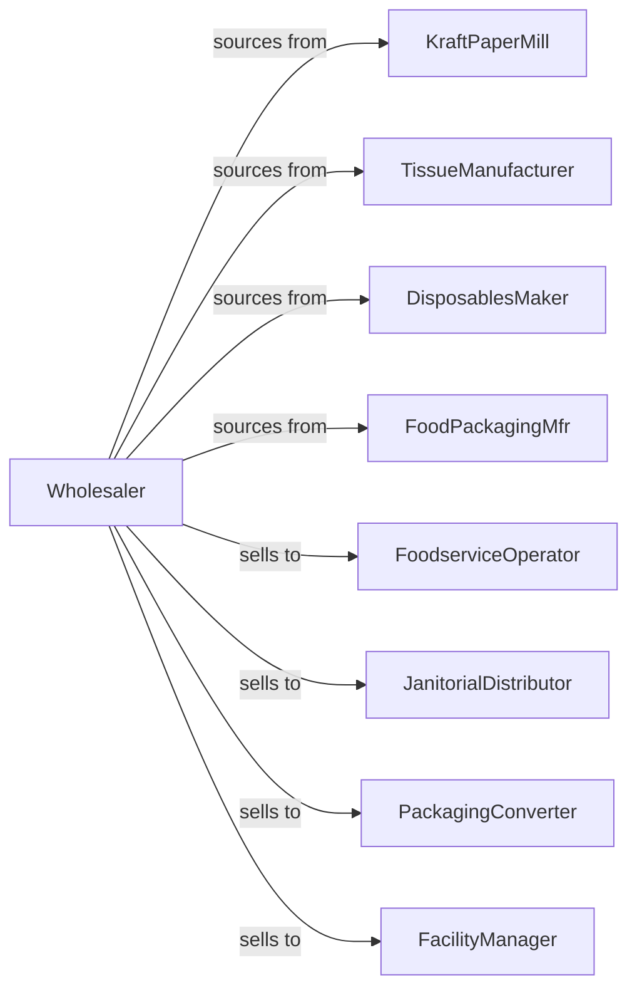

# Industrial and Personal Service Paper Merchant Wholesalers

> Business-as-Code definition for industrial and janitorial paper wholesale distribution. Models procurement, foodservice programs, and fulfillment for packaging, tissue products, and disposables.

## Overview

Industrial and personal service paper wholesalers distribute kraft paper, corrugated materials, food packaging, paper towels, napkins, tissue products, and disposable tableware to foodservice operators, janitorial distributors, and packaging converters. This definition exposes actions for product sourcing, foodservice programs, and route delivery with events for usage tracking and contract fulfillment.

## Actors

| Actor | Description |
|-------|-------------|
| KraftPaperMill | Manufactures kraft and corrugated paper |
| TissueManufacturer | Produces towels and tissue products |
| DisposablesMaker | Produces disposable tableware |
| FoodPackagingMfr | Makes food packaging products |
| FoodserviceOperator | Restaurant or institutional kitchen |
| JanitorialDistributor | Resells cleaning and paper supplies |
| PackagingConverter | Converts paper into packaging |
| FacilityManager | Manages commercial building supplies |

## Roles

| Role | Description |
|------|-------------|
| FoodserviceSpecialist | Serves restaurant accounts |
| JanSanRep | Handles janitorial supply accounts |
| RouteDriver | Delivers products on scheduled routes |
| ProductManager | Manages paper and disposables categories |
| ContractCoordinator | Manages usage-based contracts |

## Entities

| Entity | Description |
|--------|-------------|
| Product | Paper or disposable product |
| Inventory | Stock levels by location |
| PurchaseOrder | Order placed with manufacturer |
| SalesOrder | Customer order |
| Route | Scheduled delivery route |
| UsageContract | Volume-based pricing agreement |
| Dispenser | Paper towel or tissue dispenser |
| Foodservice | Restaurant account profile |
| JanSan | Janitorial supply account |
| Promotion | Manufacturer rebate or deal |
| Return | Customer return authorization |

## Actions

| Action | Description |
|--------|-------------|
| sourceProduct | Identify and onboard product lines |
| placeOrder | Submit purchase order to manufacturer |
| receiveInventory | Check in incoming products |
| stockWarehouse | Store products in locations |
| setupFoodservice | Onboard restaurant account |
| setupJanSan | Onboard janitorial account |
| quoteProducts | Price products for customer |
| processOrder | Fulfill customer order |
| deliverRoute | Execute scheduled delivery |
| installDispenser | Set up towel or tissue dispenser |
| trackUsage | Monitor customer consumption |
| processReturn | Handle customer returns |
| runPromotion | Execute manufacturer deal |
| manageContract | Administer volume agreement |

## Events

| Event | Description |
|-------|-------------|
| orderReceived | Customer placed order |
| inventoryReceived | Manufacturer shipment arrived |
| orderDelivered | Products delivered |
| routeCompleted | Scheduled deliveries finished |
| foodserviceSetup | Restaurant account onboarded |
| janSanSetup | Janitorial account onboarded |
| dispenserInstalled | Equipment placed at customer |
| usageTracked | Consumption recorded |
| contractRenewed | Volume agreement extended |
| stockLow | Inventory below threshold |
| promotionStarted | Manufacturer deal began |
| returnProcessed | Return completed |

## Searches

| Search | Description |
|--------|-------------|
| findProducts | Search by type, brand, case |
| getInventory | Check stock levels |
| getOrders | Retrieve orders by status |
| getRoutes | View delivery schedules |
| getContracts | Access volume agreements |
| getFoodserviceAccounts | List restaurant accounts |
| getJanSanAccounts | List janitorial accounts |

## Workflow



## Actor Relationships



## Usage

### Calling Actions

```typescript
import { distributeIndustrialPaper } from '@headlessly/distribute-industrial-paper'

const distributor = distributeIndustrialPaper()

// Search towel products
const towels = await distributor.findProducts({
  category: 'paper-towel',
  type: 'roll',
  dispenserCompatible: 'universal',
  casePack: 6
})

// Setup foodservice account with dispenser
const account = await distributor.setupFoodservice({
  businessName: 'Downtown Bistro',
  locations: 1,
  seating: 80,
  products: ['napkins', 'towels', 'toilet-tissue']
})

await distributor.installDispenser({
  accountId: account.id,
  location: 'restroom',
  type: 'roll-towel',
  model: 'enmotion-classic'
})

// Setup usage contract
await distributor.manageContract({
  accountId: account.id,
  term: 24,
  minimumVolume: 500,
  pricePerCase: 42.50
})
```

### Event-Driven Automation

```typescript
// Auto-reorder based on usage
distributor.usageTracked(async ({ accountId, product, consumed, remaining }) => {
  if (remaining < getReorderPoint(accountId, product)) {
    await distributor.processOrder({
      accountId,
      items: [{ product, quantity: getParLevel(accountId, product) - remaining }],
      delivery: 'next-route'
    })
  }
})

// Optimize delivery routes
distributor.orderReceived(async ({ orderId, accountId }) => {
  const route = await getCustomerRoute(accountId)

  await addToRoute({
    routeId: route.id,
    orderId,
    deliveryWindow: route.nextRun
  })
})
```
