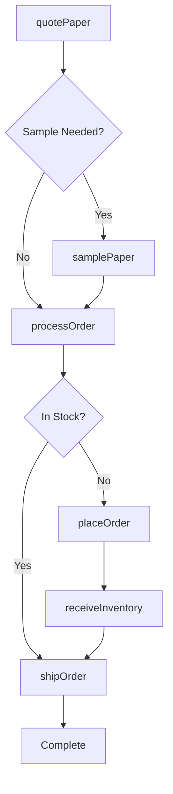
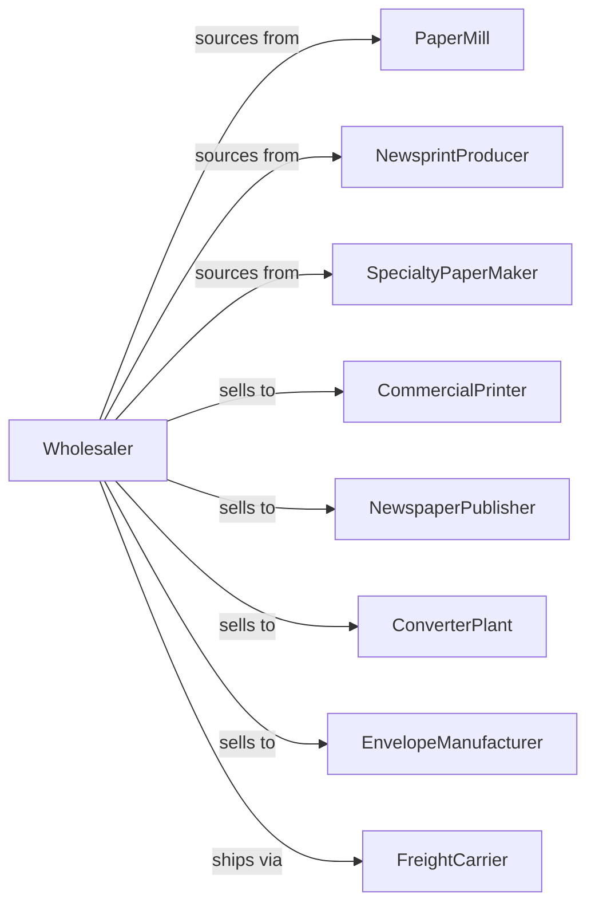

# Printing and Writing Paper Merchant Wholesalers

> Business-as-Code definition for printing and writing paper wholesale distribution. Models procurement, inventory management, and fulfillment for bulk paper products serving commercial printers and publishers.

## Overview

Printing and writing paper wholesalers distribute bulk rolls and sheets of fine paper, newsprint, groundwood paper, and envelope paper to commercial printers, publishers, and converters. This definition exposes actions for product sourcing, inventory management, and mill-direct fulfillment with events for commodity pricing and paper market fluctuations.

## Actors

| Actor | Description |
|-------|-------------|
| PaperMill | Manufactures bulk paper products |
| NewsprintProducer | Produces newsprint rolls |
| SpecialtyPaperMaker | Creates coated and specialty papers |
| CommercialPrinter | Prints publications and marketing materials |
| NewspaperPublisher | Prints newspapers and periodicals |
| ConverterPlant | Converts bulk paper into finished products |
| EnvelopeManufacturer | Produces envelopes from bulk paper |
| FreightCarrier | Transports bulk paper shipments |

## Roles

| Role | Description |
|------|-------------|
| PaperBuyer | Sources and negotiates with mills |
| SalesRepresentative | Serves printer and publisher accounts |
| InventoryManager | Manages warehouse stock levels |
| LogisticsCoordinator | Arranges bulk shipments |
| MarketAnalyst | Tracks paper commodity pricing |

## Entities

| Entity | Description |
|--------|-------------|
| Paper | Bulk paper product by grade and weight |
| Inventory | Stock levels by grade and location |
| PurchaseOrder | Order placed with paper mill |
| SalesOrder | Customer order for paper |
| Roll | Paper roll with specifications |
| Sheet | Cut sheet paper product |
| Grade | Paper quality classification |
| Quote | Price quotation for customer |
| Shipment | Bulk paper delivery |
| Contract | Term pricing agreement |
| Sample | Paper sample for customer |

## Actions

| Action | Description |
|--------|-------------|
| sourcePaper | Identify and contract with mills |
| placeOrder | Submit purchase order to mill |
| receiveInventory | Check in incoming paper shipments |
| stockWarehouse | Store paper by grade and condition |
| quotePaper | Price paper for customer |
| processOrder | Fulfill customer paper order |
| convertToSheets | Cut rolls into sheet sizes |
| shipOrder | Arrange bulk paper delivery |
| samplePaper | Send paper samples to customer |
| negotiateContract | Establish term pricing |
| trackPricing | Monitor paper commodity market |
| processReturn | Handle customer returns |
| forecastDemand | Project paper requirements |
| manageShrinkage | Track warehouse waste and damage |

## Events

| Event | Description |
|-------|-------------|
| orderReceived | Customer placed order |
| inventoryReceived | Mill shipment arrived |
| orderShipped | Paper dispatched |
| orderDelivered | Customer received paper |
| priceChanged | Paper commodity shifted |
| contractSigned | Term agreement executed |
| sampleSent | Paper samples dispatched |
| stockLow | Inventory below threshold |
| millAllocation | Supply constraint announced |
| gradeDiscontinued | Paper grade ending production |
| qualityIssue | Paper defect reported |
| shipmentDamaged | Transit damage occurred |

## Searches

| Search | Description |
|--------|-------------|
| findPaper | Search by grade, weight, finish |
| getInventory | Check stock levels by grade |
| getOrders | Retrieve orders by status |
| getPricing | View current market prices |
| getContracts | Access term agreements |
| getCustomers | List printer and publisher accounts |
| getShipments | Track deliveries |

## Workflow



## Actor Relationships



## Usage

### Calling Actions

```typescript
import { distributePrintingWriting } from '@headlessly/distribute-printing-writing'

const distributor = distributePrintingWriting()

// Search paper inventory
const paper = await distributor.findPaper({
  type: 'offset',
  weight: 60,
  brightness: 92,
  finish: 'matte',
  quantity: { min: 20, unit: 'tons' }
})

// Quote for commercial printer
const quote = await distributor.quotePaper({
  customerId: 'printer-456',
  items: [
    { grade: 'offset-60lb', quantity: 40, unit: 'tons' },
    { grade: 'coated-80lb', quantity: 20, unit: 'tons' }
  ],
  deliverySchedule: 'weekly',
  contractTerm: 12
})

// Process order from stock
await distributor.processOrder({
  customerId: 'printer-456',
  quoteId: quote.id,
  shipDate: '2024-04-15',
  deliveryType: 'ltl'
})
```

### Event-Driven Automation

```typescript
// Reorder when stock low
distributor.stockLow(async ({ grade, currentLevel, reorderPoint }) => {
  const millLead = getMillLeadTime(grade)

  await distributor.placeOrder({
    grade,
    quantity: calculateEOQ(grade),
    deliveryDate: addDays(new Date(), millLead)
  })
})

// Notify customers on price changes
distributor.priceChanged(async ({ grade, oldPrice, newPrice, changePercent }) => {
  if (Math.abs(changePercent) > 5) {
    const customers = await getCustomersWithContract(grade)

    for (const customer of customers) {
      await notifyCustomer({
        customerId: customer.id,
        message: `Price change for ${grade}: ${changePercent}% effective next month`
      })
    }
  }
})
```
