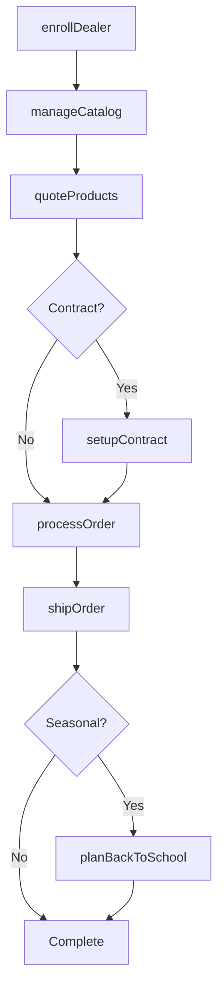
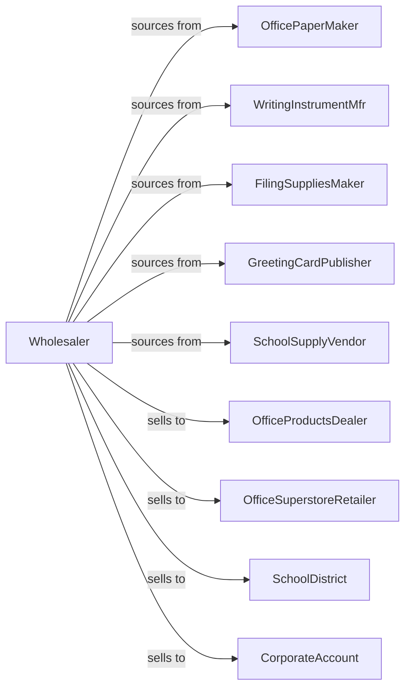

# Stationery and Office Supplies Merchant Wholesalers

> Business-as-Code definition for stationery and office supplies wholesale distribution. Models procurement, dealer programs, and B2B fulfillment for office products, school supplies, and social stationery.

## Overview

Stationery and office supplies wholesalers distribute office paper, writing instruments, filing supplies, greeting cards, gift wrap, and school supplies to office products dealers, retailers, and commercial accounts. This definition exposes actions for product sourcing, dealer programs, and contract fulfillment with events for seasonal demand and back-to-school periods.

## Actors

| Actor | Description |
|-------|-------------|
| OfficePaperMaker | Manufactures printer and copier paper |
| WritingInstrumentMfr | Produces pens and pencils |
| FilingSuppliesMaker | Manufactures folders and organizers |
| GreetingCardPublisher | Produces greeting cards |
| SchoolSupplyVendor | Makes classroom supplies |
| OfficeProductsDealer | Sells office supplies to businesses |
| OfficeSuperstoreRetailer | Large office products chain |
| SchoolDistrict | Purchases supplies for schools |
| CorporateAccount | Large business office supply buyer |

## Roles

| Role | Description |
|------|-------------|
| CategoryManager | Manages product categories |
| SalesRepresentative | Serves dealer accounts |
| ContractSpecialist | Manages corporate contracts |
| WarehouseManager | Oversees inventory operations |
| MerchandisingCoordinator | Supports dealer displays |

## Entities

| Entity | Description |
|--------|-------------|
| Product | Office or stationery supply item |
| Inventory | Stock levels by location |
| PurchaseOrder | Order placed with manufacturer |
| SalesOrder | Customer order |
| DealerProgram | Authorized dealer agreement |
| Contract | Corporate pricing agreement |
| Catalog | Product catalog for dealers |
| Promotion | Manufacturer rebate or special |
| BackToSchool | Seasonal program |
| Quote | Price quotation |
| Return | Customer return authorization |

## Actions

| Action | Description |
|--------|-------------|
| sourceProduct | Identify and onboard product lines |
| placeOrder | Submit purchase order to manufacturer |
| receiveInventory | Check in incoming products |
| stockWarehouse | Store products in locations |
| enrollDealer | Add dealer to program |
| quoteProducts | Price products for customer |
| processOrder | Fulfill customer order |
| shipOrder | Dispatch products |
| setupContract | Establish corporate agreement |
| runPromotion | Execute manufacturer special |
| planBackToSchool | Prepare seasonal inventory |
| processReturn | Handle customer returns |
| manageCatalog | Update product listings |
| forecastSeasonal | Project seasonal demand |

## Events

| Event | Description |
|-------|-------------|
| orderReceived | Customer placed order |
| inventoryReceived | Manufacturer shipment arrived |
| orderShipped | Products dispatched |
| orderDelivered | Customer received products |
| dealerEnrolled | New dealer authorized |
| contractSigned | Corporate agreement executed |
| promotionStarted | Special pricing began |
| backToSchoolStarting | School season approaching |
| catalogReleased | New catalog published |
| stockLow | Inventory below threshold |
| priceChanged | Product pricing updated |
| returnProcessed | Return completed |

## Searches

| Search | Description |
|--------|-------------|
| findProducts | Search by category, brand, specs |
| getInventory | Check stock levels |
| getOrders | Retrieve orders by status |
| getDealers | List authorized dealers |
| getContracts | Access corporate agreements |
| getPromotions | View active specials |
| getCatalogs | Access product catalogs |

## Workflow



## Actor Relationships



## Usage

### Calling Actions

```typescript
import { distributeStationeryOffice } from '@headlessly/distribute-stationery-office'

const distributor = distributeStationeryOffice()

// Search office paper
const paper = await distributor.findProducts({
  category: 'office-paper',
  type: 'copy-paper',
  brightness: 92,
  weight: '20lb',
  case: 10
})

// Setup corporate contract
const contract = await distributor.setupContract({
  customerId: 'corp-account-789',
  term: 24,
  products: ['copy-paper', 'writing-instruments', 'filing'],
  discountTier: 'enterprise',
  minimumAnnual: 250000
})

// Plan back-to-school inventory
await distributor.planBackToSchool({
  categories: ['notebooks', 'pencils', 'folders', 'backpacks'],
  buildup: {
    start: '2024-06-01',
    peak: '2024-08-01'
  },
  channels: ['retail', 'school-district']
})
```

### Event-Driven Automation

```typescript
// Prepare for back-to-school
distributor.backToSchoolStarting(async ({ weeksOut }) => {
  if (weeksOut === 8) {
    const forecast = await distributor.forecastSeasonal({ season: 'bts' })

    await distributor.placeOrder({
      items: forecast.recommendedStock,
      priority: 'seasonal'
    })
  }
})

// Notify on catalog update
distributor.catalogReleased(async ({ catalogId, version }) => {
  const dealers = await getActiveDealers()

  for (const dealer of dealers) {
    await notifyDealer({
      dealerId: dealer.id,
      message: `New catalog ${version} available`,
      catalogUrl: getCatalogUrl(catalogId)
    })
  }
})
```
