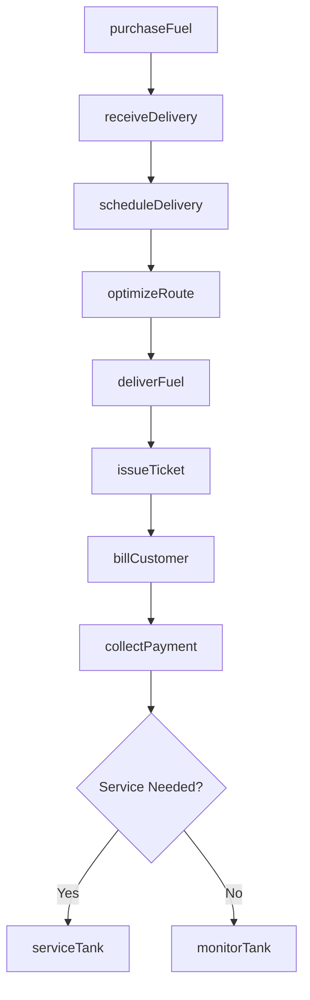
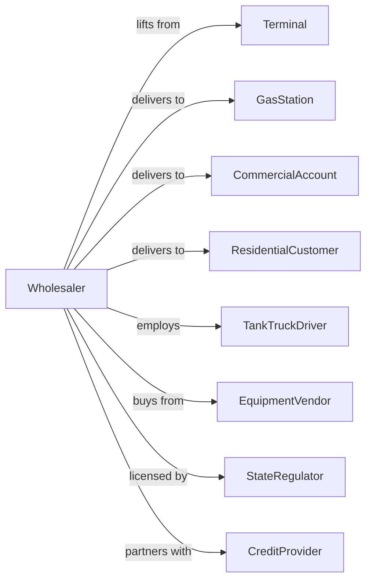

# Petroleum and Petroleum Products Merchant Wholesalers (except Bulk Stations and Terminals)

> Business-as-Code definition for petroleum jobber and fuel distribution operations. Models the complete fuel purchasing, storage, and delivery cycle to retail and commercial customers.

## Overview

Petroleum merchant wholesalers purchase fuel from terminals and distribute gasoline, diesel, heating oil, lubricants, and propane to retail stations, commercial accounts, and residential customers. This definition exposes actions for fuel procurement, fleet management, delivery scheduling, and customer billing with events for automated route optimization and inventory management.

## Actors

| Actor | Description |
|-------|-------------|
| Terminal | Bulk fuel terminal supplying rack product |
| GasStation | Retail fuel station receiving deliveries |
| CommercialAccount | Fleet or industrial customer purchasing fuel |
| ResidentialCustomer | Homeowner receiving heating oil or propane |
| TankTruckDriver | Operates fuel delivery vehicles |
| EquipmentVendor | Supplies tanks, pumps, and dispensers |
| StateRegulator | Oversees fuel quality and weights |
| CreditProvider | Provides fleet fuel cards and financing |

## Roles

| Role | Description |
|------|-------------|
| OperationsManager | Oversees fleet and delivery operations |
| Dispatcher | Schedules deliveries and manages routes |
| SalesRepresentative | Manages customer accounts and pricing |
| DeliveryDriver | Operates tank trucks for fuel delivery |
| ServiceTechnician | Maintains customer tanks and equipment |
| CreditManager | Handles accounts receivable and collections |

## Entities

| Entity | Description |
|--------|-------------|
| Fuel | Gasoline, diesel, heating oil, or propane product |
| CustomerTank | Underground or aboveground storage at customer site |
| DeliveryTicket | Documentation for fuel delivery |
| DeliveryTruck | Tank truck with capacity and compartments |
| Route | Optimized sequence of delivery stops |
| PriceAgreement | Contract pricing for commercial accounts |
| Invoice | Billing document for delivered fuel |
| Inventory | Fuel on hand at warehouse or in trucks |
| ServiceOrder | Equipment maintenance work order |
| FleetCard | Credit card for commercial fuel purchases |

## Actions

| Action | Description |
|--------|-------------|
| purchaseFuel | Lift fuel at terminal rack |
| receiveDelivery | Accept fuel into company storage |
| scheduleDelivery | Plan customer fuel deliveries |
| optimizeRoute | Calculate efficient delivery sequence |
| deliverFuel | Transport and dispense fuel at customer site |
| issueTicket | Generate delivery documentation |
| billCustomer | Create and send invoice for delivery |
| collectPayment | Process customer payment |
| monitorTank | Track customer tank levels remotely |
| serviceTank | Perform equipment maintenance |
| priceAccount | Set pricing for commercial customer |
| manageFleet | Track and maintain delivery vehicles |

## Events

| Event | Description |
|-------|-------------|
| fuelPurchased | Terminal lift completed |
| deliveryScheduled | Customer delivery planned |
| routeOptimized | Delivery sequence calculated |
| deliveryCompleted | Fuel dispensed at customer site |
| ticketIssued | Delivery documentation generated |
| invoiceSent | Customer billing transmitted |
| paymentReceived | Customer payment processed |
| tankLow | Customer tank below reorder level |
| serviceRequired | Equipment maintenance needed |
| priceChanged | Rack or customer pricing updated |
| truckMaintenance | Vehicle service due |
| creditAlert | Customer account past due |

## Searches

| Search | Description |
|--------|-------------|
| getCustomers | Search customer accounts by type or location |
| getDeliverySchedule | View planned deliveries by date or route |
| getTankLevels | Check customer tank inventories |
| getInvoices | Retrieve billing by customer or status |
| getFleetStatus | Check vehicle availability and maintenance |
| getPricing | View rack and customer pricing |
| getDeliveryHistory | Retrieve historical deliveries by customer |

## Workflow



## Actor Relationships



## Usage

### Calling Actions

```typescript
import { distributeFuel } from '@headlessly/distribute-fuel'

const jobber = distributeFuel()

// Search customer accounts by type or location
const getCustomersResult = await jobber.getCustomers({ status: 'active' })

// View planned deliveries by date or route
const getDeliveryScheduleResult = await jobber.getDeliverySchedule({ status: 'active' })

// Purchase fuel at terminal
const lift = await jobber.purchaseFuel({
  terminalId: 'gulf-terminal-houston',
  products: [
    { product: 'regular-unleaded', volume: 8500, unit: 'gal' },
    { product: 'diesel-ulsd', volume: 3500, unit: 'gal' }
  ],
  truckId: 'truck-101'
})

// Schedule customer deliveries
await jobber.scheduleDelivery({
  customerId: 'quickmart-station-5',
  products: [
    { product: 'regular-unleaded', volume: 4000, unit: 'gal' },
    { product: 'premium-unleaded', volume: 2000, unit: 'gal' }
  ],
  preferredDate: '2024-02-12',
  urgency: 'normal'
})

// Optimize delivery route
const route = await jobber.optimizeRoute({
  date: '2024-02-12',
  truckId: 'truck-101',
  startLocation: 'depot-main'
})
```

### Event-Driven Automation

```typescript
// Auto-schedule on low tank
jobber.tankLow(async ({ customerId, product, currentLevel, capacity }) => {
  const fillVolume = capacity * 0.85 - currentLevel
  await jobber.scheduleDelivery({
    customerId,
    products: [{ product, volume: fillVolume }],
    urgency: currentLevel < capacity * 0.15 ? 'urgent' : 'normal'
  })
})

// Auto-send payment reminder
jobber.creditAlert(async ({ customerId, invoiceId, daysPastDue, amount }) => {
  if (daysPastDue >= 30) {
    await sendPaymentReminder({
      customerId,
      invoiceId,
      amount,
      message: `Invoice ${invoiceId} is ${daysPastDue} days past due`
    })
  }
})
```
