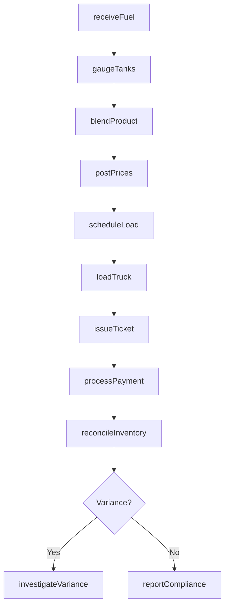
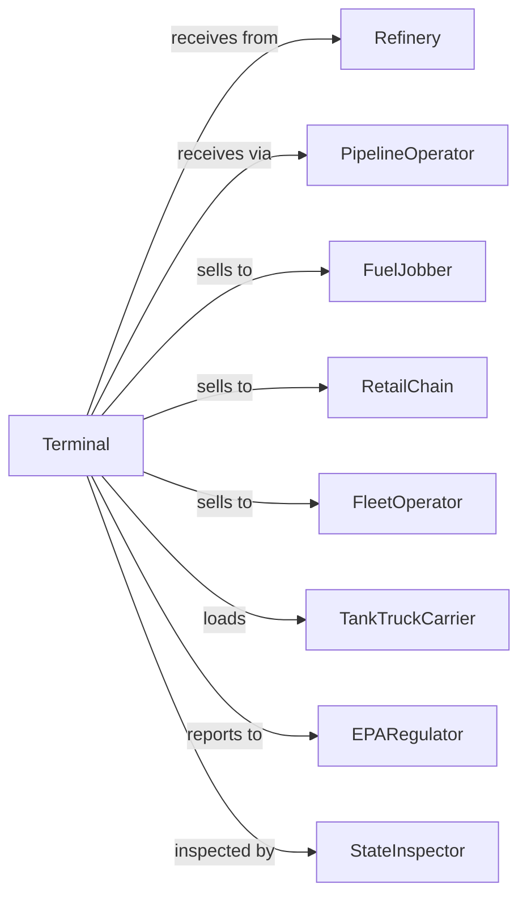

# Petroleum Bulk Stations and Terminals

> Business-as-Code definition for petroleum terminal operations. Models the complete bulk fuel receiving, storage, and distribution cycle from pipeline to truck rack delivery.

## Overview

Petroleum bulk stations and terminals operate tank farms and loading facilities to receive, store, and distribute gasoline, diesel, heating oil, and other petroleum products. This definition exposes actions for fuel receipt, inventory management, additive blending, and rack loading with events for automated inventory reconciliation and regulatory compliance.

## Actors

| Actor | Description |
|-------|-------------|
| Refinery | Petroleum refiner supplying base fuels |
| PipelineOperator | Transports fuel via pipeline to terminal |
| FuelJobber | Petroleum marketer purchasing rack fuel |
| RetailChain | Gas station network purchasing fuel |
| FleetOperator | Commercial fleet purchasing bulk fuel |
| TankTruckCarrier | Transport company hauling fuel from terminal |
| EPARegulator | Environmental Protection Agency oversight |
| StateInspector | State weights and measures official |

## Roles

| Role | Description |
|------|-------------|
| TerminalManager | Oversees all terminal operations and staff |
| RackOperator | Manages truck loading and blending operations |
| TankGauger | Monitors inventory levels and tank conditions |
| DispatchCoordinator | Schedules truck loading appointments |
| ComplianceOfficer | Ensures environmental and safety compliance |
| AccountsManager | Handles customer accounts and credit |
| AdditiveTechnician | Blends dyes, detergents, and octane boosters into base fuel at the rack |

## Entities

| Entity | Description |
|--------|-------------|
| StorageTank | Bulk tank with product, capacity, and level |
| FuelProduct | Gasoline, diesel, or other petroleum grade |
| Inventory | Current volumes by product and tank |
| LoadTicket | Documentation for truck rack transaction |
| Additive | Detergent or performance additive for blending |
| Blend | Formulated product with base fuel and additives |
| CustomerAccount | Buyer profile with credit and lifting rights |
| RackPrice | Posted price for fuel at terminal rack |
| TankGauge | Measurement record for inventory reconciliation |
| BillOfLading | Shipping document for fuel delivery |

## Actions

| Action | Description |
|--------|-------------|
| receiveFuel | Accept pipeline or barge delivery into tanks |
| gaugeTanks | Measure inventory levels for reconciliation |
| blendProduct | Mix additives into base fuel |
| loadTruck | Dispense fuel at rack into tank truck |
| postPrices | Set and publish rack prices |
| scheduleLoad | Book truck loading appointment |
| issueTicket | Generate load ticket with volumes and pricing |
| reconcileInventory | Compare book versus physical inventory |
| processPayment | Collect payment for fuel lifted |
| maintainTank | Perform tank inspection and maintenance |
| reportCompliance | Submit environmental and regulatory reports |
| transferProduct | Move fuel between tanks |

## Events

| Event | Description |
|-------|-------------|
| fuelReceived | Pipeline or barge delivery completed |
| tanksGauged | Inventory measurement recorded |
| productBlended | Additive injection completed |
| truckLoaded | Fuel dispensed at rack |
| pricesPosted | New rack prices published |
| loadScheduled | Truck appointment confirmed |
| ticketIssued | Load documentation generated |
| inventoryReconciled | Book/physical comparison completed |
| paymentReceived | Customer payment processed |
| inventoryDepleted | Stock fell below reorder level |
| inventoryVarianceDetected | Gain or loss detected |
| complianceViolationDetected | Compliance violation or expiration detected |

## Searches

| Search | Description |
|--------|-------------|
| getInventory | Check tank levels by product |
| getLoadSchedule | View upcoming truck appointments |
| getRackPrices | Get current posted prices |
| findCustomers | Search customer accounts and credit |
| getLoadHistory | Retrieve historical loading tickets |
| getTankStatus | Check tank condition and maintenance |
| getComplianceRecords | View regulatory filings |

## Workflow



## Actor Relationships



## Usage

### Calling Actions

```typescript
import { distributePetroleum } from '@headlessly/distribute-petroleum'

const terminal = distributePetroleum()

// Check tank levels by product
const getInventoryResult = await terminal.getInventory({ status: 'available', category: 'main' })

// View upcoming truck appointments
const getLoadScheduleResult = await terminal.getLoadSchedule({ status: 'active' })

// Receive pipeline delivery
const receipt = await terminal.receiveFuel({
  source: 'gulf-coast-pipeline',
  product: 'regular-unleaded',
  volume: 250000,
  unit: 'gal',
  tankId: 'tank-101'
})

// Blend branded fuel
await terminal.blendProduct({
  baseFuel: 'regular-unleaded',
  additive: 'techron-detergent',
  blendRate: 0.001,
  outputProduct: 'chevron-regular'
})

// Load customer truck
const ticket = await terminal.loadTruck({
  customerId: 'jones-petroleum',
  truckId: 'TX-456',
  products: [
    { product: 'chevron-regular', volume: 8500, unit: 'gal' },
    { product: 'diesel-ulsd', volume: 3500, unit: 'gal' }
  ]
})
```

### Event-Driven Automation

```typescript
// Auto-alert on low inventory
terminal.inventoryDepleted(async ({ tankId, product, currentLevel, threshold }) => {
  await notifySupplyTeam({
    message: `${product} in ${tankId} at ${currentLevel} gal - below ${threshold}`
  })
})

// Auto-investigate inventory variance
terminal.inventoryVarianceDetected(async ({ tankId, bookVolume, physicalVolume }) => {
  const variance = bookVolume - physicalVolume
  if (Math.abs(variance) > 500) {
    await createInvestigation({
      tankId,
      variance,
      type: variance > 0 ? 'loss' : 'gain'
    })
  }
})
```
